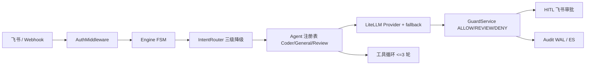

# Agent Gateway

**LLM 治理层**：把不受控的模型输出收进可审批、可审计、可回归的闭环——意图路由省成本、策略守卫 + 真人 HITL 刹车、评测门禁防退化，附 GitHub PR 审查垂直应用。

> **定位说明（重要）**：这个项目**不是**一个"什么都会的 agent"，而是一层治理框架。它做得最扎实的地方与模型聪不聪明无关：拦截、审批、留痕、回归。模型是它治下的对象，可以随便换（本机演示用小模型，生产接强 API 都行），闸门不动。能力清单（多 Provider、双引擎、长期记忆、任务 Agent）是第二层证据，不是卖点本身。见 [`delivery/定位与减法清单.md`](delivery/定位与减法清单.md)。

项目基于 FastAPI 自研状态机编排，默认运行时不依赖 LangChain/LangGraph；LLM 调用层使用 LiteLLM 支持多 Provider、fallback 与成本统计。另提供可选的 LangGraph 第二引擎（`ENGINE=langgraph`）用于框架等价性验证，默认关闭。

## 架构



请求链路：飞书/Webhook → 鉴权 → 限流 → FSM → 意图路由（正则 → 微模型 → 路由 LLM）→ Agent 执行 → 静态评估 → 守卫策略 → HITL/拦截 → 渠道适配 → 审计日志。

## 三大卖点

### 1. 智能路由省钱

- 三级降级意图路由：正则命中直接返回，不调 LLM；未命中的才升级到微模型/路由模型，**再失败才落默认意图**。
- LiteLLM 内核：`chat` / `chat_with_tools` 接口保持兼容，内置多模型 fallback，网络/429/5xx 自动切换。
- 每次调用记录 `model_used`、`cost_usd`、`llm_latency_ms`、`fallback_used`，随审计日志落盘。
- Eval 实测（`evals/datasets/intent.jsonl`，50 条）：意图准确率 1.0，其中 **46 条（92%）由正则直接命中**。

| 路由层级 | 说明 | 50 条用例命中 |
|---|---|---|
| 正则 | 0 LLM 调用，毫秒级返回 | 46（92%） |
| 默认意图 | 未命中正则，且该维度**不注入 LLM** | 4（8%） |

> ⚠️ 这个维度**只验证正则表**：`run_intent_eval` 构造的 `IntentRouter()` 不注入任何 LLM，
> 所以未命中正则的 4 条直接拿到默认意图 `assistant`——而它们的 `expected_intent` 恰好也是
> `assistant`，等于"默认值命中默认值"。**它不含模型兜底路径的任何信息。**
> 模型兜底路径的稳定性由 `intent_consistency` 维度单独测（下面第 3 节），实测预热后
> 11 条非正则输入 × 5 次重放 = 55/55 一致。

每次真实调用的成本都会写入审计日志 `cost_usd` 字段，可据此按周聚合实际节省金额。

### 2. 安全守卫 + HITL

- 策略引擎覆盖内网 IP、密钥/Token、价格承诺，输出命中 `deny` 直接拦截，`review` 进入人工审批。
- 静态评估器同样接入刹车（ADR-010）：AST 危险类问题（`exec`/`subprocess`/写模式 `open`…）直接
  拦为 `deny`（不可审批），空输出、超长、非法 JSON 等质量问题进人工 `review`。此前
  `need_human_review` 只是响应体里的一个字段，输出照样以 `ok` 送达。
- 执行期失败带归因重试一次，再失败自动升级人工（复用同一套审批闭环，`hitl_kind` 区分来源）。
- 策略命中 `review` 的输出强制人工审批，飞书审批卡片闭环：通过送达、拒绝丢弃；`execute_code` 工具未开放，避免占位桩造成假审批。
- 红队实测：200 条对抗用例，期望拦截 120 条全部命中，漏网 0，误拦截 0，召回率/精确率 100%。

运行红队：

```bash
uv run python scripts/redteam/run_redteam.py
```

### 3. 自建 Eval 评估体系

每次改动可以跑全部维度并输出 JSON 报告：

```bash
uv run python evals/run_evals.py --offline   # 离线：e2e 与一致性走假引擎/标 skipped，CI 用这条
uv run python evals/run_evals.py             # 活体：真实编排 + 真实判分（需 Ollama/pgvector 就绪）
```

| 维度 | 数据量 | 当前指标 | **测的到底是什么** |
|---|---|---|---|
| Intent 意图路由 | 50 条 | 准确率 1.0 | **只测正则表**（不注入 LLM，见第 1 节警示） |
| Intent 一致性 | 11 条 × 5 次 | 预热后 `stable 1.0 / degraded 0`（55/55 一致） | **模型兜底路径**：同输入重放看是否收敛。**没有期望值**，设计者无法自证 |
| Guard 守卫对抗 | 50 条 | deny 召回 1.0 / 精确率 1.0 | 策略正则表 |
| 工具选择 | 17 条 | 准确率 1.0（CI 硬门禁） | **`MockTaskLLM` 的规则表**，不是真实 Agent 的工具选择 |
| E2E 端到端 | 30 条 | 活体 `run=30 skipped=0`，success 1.0；**intent_match 14/30** | 真实编排；judge 均分与均时随机器/模型变化，不写死数字。**`intent_match` 是"与数据集标签的偏离率"，不是"路由准确率"**——标签里 10 例的期望值其实是默认桶 `assistant`（哨兵而非真值），与路由 LLM 的判定天然不一致 |
| HITL 决策回流 | 4 条 | approve_rate 0.5，介入率 0.0065 | **全部是本地模拟点击的种子**（会话前缀 `probe-*`），n=4 无统计意义 |

> **看这张表的方式**：前三行里有两行测的是"我自己写的规则表"，一行（一致性）测的是模型路径
> 且无法自证；e2e 与 HITL 两行的数字目前不具统计意义。报告与命令行摘要会把
> `degraded=…`、`(全为模拟)` 这类限定词直接打出来，就是为了不让"全绿"被误读。

> **活体 e2e 的三次修复（2026-09-22）**：此前真跑必炸，`--offline` 是唯一跑法。三处原因都已修：
> ① 判分器自建配置——base_url 取 `OPENAI_BASE_URL`（local 形态指向 Ollama）而 model 硬编码
> `gpt-4o-mini`，两个来源混用导致 `model 'gpt-4o-mini' not found`；② eval 进程没有 FastAPI
> lifespan，漏了 `vector_client.start()`，检索腿静默空转（且 Windows 默认 Proactor 循环与
> psycopg 异步池不兼容，需 Selector 循环）；③ `--engine fsm|langgraph` 传入的是**真实** runner，
> 却被 `use_store = pipeline is None` 判成"注入了假 pipeline"而跳过 `start()`——那两个引擎跑的
> 其实是没有 RAG 上下文的链路，而 e2e 照样报 `success 1.0`，只在日志里刷
> `后端已降级，search 返回空结果（None）`。现改为显式 `use_store` 参数，并由
> `test_evals_runner.py` 钉住启停生命周期。**CI 仍跑 `--offline`**：门禁不引入网络依赖，
> 活体那跑是本地/发布前的验收。

红队基线（`scripts/redteam/cases.json`，200 条）：

| 维度 | 数据量 | 当前指标 |
|---|---|---|
| 越狱 / 注入 / 诱导 | 150 条 | 期望拦截 120 条全部命中，漏网 0 |
| 正常对照 | 50 条 | 误拦截 0 |
| 汇总 | 200 条 | 召回率 1.0 / 精确率 1.0 / 误拦截率 0.0 |

报告写入 `evals/reports/latest.json`，包含 `git_sha`、混淆矩阵、拦截指标和 e2e 均分/延迟/成本；intent 准确率低于 0.9 或 guard deny 召回低于 0.95 时退出码非零。

## PR 审查垂直应用

内置 GitHub PR 多 Agent 审查流水线：Triage → 静态分析 → 语义 RAG → 测试覆盖 → 汇总报告。

- Webhook 演示路径：`POST /webhook/github/review`（GitHub webhook body）
- 网关指令：发送 `/review` 后输入 `owner/repo#PR号`
- 无 `GITHUB_TOKEN` 时返回优雅降级文案，不会崩溃

审查结果包含严重级别统计、建议结论和摘要文本，`need_human_review` 时会走守卫/HITL 审计闭环。

## 快速开始

```bash
cd moa-gateway

python -m venv .venv
.venv\Scripts\activate          # Windows
# source .venv/bin/activate     # Linux / macOS

pip install uv
uv sync --all-extras --dev

cp .env.template .env           # 填入真实配置
uv run python scripts/doctor.py  # 检查 Redis / Ollama / pgvector / 端口
.venv\Scripts\python.exe -m app --host 0.0.0.0 --port 8081
```

Windows 上请使用 `python -m app`，它会在 Uvicorn 建 loop 前切换到
`WindowsSelectorEventLoopPolicy`，确保 psycopg 异步 pgvector 连接池可用。

访问：

- 管理后台：<http://localhost:8081/dashboard>
- 自主任务对话：<http://localhost:8081/dashboard/chat>
- 健康检查：<http://localhost:8081/health>
- 依赖级健康检查：<http://localhost:8081/healthz>

8081 是项目推荐的本地端口，用于避开常见的 8080 占用；仍可用 `GATEWAY_PORT` 改端口。

### 本机环境复活

仓库自带环境诊断器，会逐项检查 Python、`.env`、鉴权配置、端口、Redis、
Ollama 主模型、pgvector 和 embedding，并给出可直接执行的修复提示：

```bash
uv run python scripts/doctor.py
uv run python scripts/doctor.py --json
```

使用仓库 Compose 启动持久化依赖：

```bash
docker compose -f docker-compose.dev.yml up -d redis postgres
ollama serve
ollama pull qwen2.5:7b
ollama pull qwen2.5:3b
ollama pull nomic-embed-text:latest
```

Compose 默认将 Redis 映射到 `6380`、pgvector 映射到 `5433`、网关映射到 `8081`，
避免与宿主机已有服务抢占默认端口。`VECTOR_DB_EMBEDDING_DIM` 与
`CODE_REVIEW_EMBEDDING_DIM` 默认按本地 `nomic-embed-text` 的 768 维配置。

### 一键起停（演示前必跑）

```powershell
powershell -ExecutionPolicy Bypass -File scripts\start_stack.ps1            # 拉起容器 + Ollama + 网关并等 healthz
powershell -ExecutionPolicy Bypass -File scripts\start_stack.ps1 -Action status
powershell -ExecutionPolicy Bypass -File scripts\start_stack.ps1 -Action stop
```

按顺序探测并拉起三样依赖：容器（redis 6380 / postgres 5433）→ Ollama（11434）→ 网关（8081），
最后等 `/healthz` 通过。**为什么需要它**：2026-09-20 出过一次事故——容器停了，网关启动阻塞/退出，
飞书卡片回调打到隧道后 origin 无响应，客户端报 `200671 回调地址不可达`。演示前跑一次即可避免。

开机自启（可选，管理员执行一次）：

```powershell
schtasks /Create /TN "moa-gateway stack" /SC ONLOGON /RL LIMITED ^
  /TR "powershell -ExecutionPolicy Bypass -WindowStyle Hidden -File <仓库路径>\scripts\start_stack.ps1"
```

`stop` 只停网关与容器，不停 Ollama（它常被本机其他工具共用）。

## 测试与质量

```bash
# 单元测试
.venv\Scripts\python.exe -m pytest tests/unit -q

# 静态检查
uv run ruff check .

# 安全扫描
uv run bandit -r app -q -s B105,B107,B110,B112,B324

# 评估冒烟
uv run python evals/run_evals.py --offline

# 真实 pgvector + embedding 验收
uv run python scripts/verify_vector_path.py
uv run python scripts/verify_code_review_rag.py

# 长期记忆生命周期验收（跨会话召回 / 冲突覆盖 / 遗忘）
uv run python scripts/verify_long_term_memory.py
```

GitHub Actions CI 会依次执行 pytest、ruff、bandit 和 eval offline；Docker 镜像使用 `python:3.12-slim` + uv 构建。

## 为什么不用 LangChain/LangGraph

核心编排是自研 FSM：状态转移可控、依赖面小、便于学习与面试讲解。多 Agent 网关最需要的是稳定的路由、守卫、审计闭环，而不是再套一层编排框架；LLM 调用层交给 LiteLLM 统一 Provider/fallback/成本即可。

结论不是"没比较过"：仓库里保留了 `app/orchestration/graph.py` 作为**可选的** LangGraph 适配器，把同一条请求链
（route → retrieve → execute → evaluate → guard → HITL → deliver）表达成 `StateGraph`，与 FSM
管道共用同一批协作者对象，并由 `tests/unit/test_langgraph_adapter.py` 做逐字段等价校验。它默认不参与运行时，
依赖也是独立的可选 extra（`uv sync --extra langgraph`），因为解析 LangGraph 会连带拉入 langsmith 等约 20 个包。

**默认运行时仍是 FSM，不替换。** 适配器的价值是"用代码回答标准框架在同约束下能否等价实现"，而不是把控制流
交给框架：FSM 才是这个项目可控性与审计叙事的基础，替换它等于把既有测试、ADR 与守卫/HITL 闭环一起推倒重来。

### 双引擎开关

`ENGINE=langgraph` 时消息路径交给图，四类路径仍回落 FSM：`/` 开头的命令、`RESET`/`CANCEL`、敏感消息挂起、
已有待审批或敏感挂起的会话。两条引擎共用同一个 `SessionStore`（审批）、同一份协作者对象与同一条请求日志
（图路径由 dispatcher 统一落账），因此切换不会静默丢功能。

- 缺 langgraph extra、`ENGINE` 取值未知、或图在运行中抛异常时，均告警并回退 FSM；启动不依赖可选依赖。
- 等价性由 `tests/unit/test_engine_parity_golden.py` 的三个确定性场景（纯回答 / 真实 TaskAgent 工具循环 /
  REVIEW→审批）逐字段比对，与 `test_langgraph_adapter.py` 一起进 CI。
- `evals/run_evals.py --engine fsm|langgraph` 可把同一份 e2e 数据集指向任一引擎；`--offline` 跑的是假引擎，
  不经过真实编排，所以门禁落在上面那组单测。**不带 `--offline` 则走真实编排 + 真实判分**（2026-09-22 起可用，
  需 Ollama 与 pgvector 就绪；此前因判分器配置错与存储未初始化而必炸）。注：`--engine` 与默认路径现在都会
  启停真实向量存储（此前 `--engine` 会静默跳过，跑的其实是没有 RAG 上下文的链路）。

## 简历条目草稿

> **agent-gateway**（FastAPI · Redis · LiteLLM · OpenTelemetry）
> - 三级降级意图路由 + Provider fallback，微模型分流简单请求，Eval 实测 50 条用例中 46 条正则直出（0 LLM 调用），成本随审计日志逐次核算。
> - 任务状态机覆盖完整请求生命周期（`INIT→ROUTED→EXECUTING→OUTPUT_READY→COMPLETED`，失败走 `RETRY→SUSPENDED`）；执行期失败带归因重试一次、再失败自动升级人工审批。重试预算由状态机结构决定并有漂移守卫，双引擎事件序列逐字段等价（golden 含失败升级场景）。
> - 策略守卫 + RBAC + 飞书 HITL 审批闭环，红队 200 条对抗用例召回率/精确率 100%。
> - 自建 Eval 体系（150 条数据集 + LLM-as-judge），每次改动离线回归出 JSON 报告。
> - 后端工程：鉴权中间件、Redis 会话存储（对话记忆 / HITL 审批状态 / 健康探活）、审计 WAL（用 ContextVar 把 trace 贯通 16 个调用点）、Docker + CI；OTel 为**预留接口**（未接 exporter，见"已知边界"——别写成"OTel 链路"）。
> - 支持 FSM / LangGraph 双引擎可切换（`ENGINE`），3 个 golden 场景逐字段等价验证进 CI。
> - 统一错误契约（`ErrorCode` 枚举贯穿双引擎与路由层）+ per-session 预算拦截（`BUDGET_SESSION_LIMIT_USD`），配置层非法值启动即 fail-fast。
> - 垂直应用：GitHub PR 多 Agent 代码审查（Triage → 静态分析 → 语义 RAG → 测试覆盖 → 报告）。

## 已知边界

- 执行期状态与重试（ADR-010）：FSM 覆盖完整请求生命周期
  （`INIT→ROUTED→EXECUTING→OUTPUT_READY→COMPLETED`，失败走 `RETRY→SUSPENDED`），因此成功响应
  的 `state` 是 `COMPLETED`（此前停在 `ROUTED`——四个状态当时是装饰）。重试预算是**状态机结构**
  （`RETRY_BUDGET = 1`）而不是配置项，有漂移守卫钉住；失败原因经 `AgentEnvelope.failure_reason`
  喂回 prompt，重试耗尽后升级人工审批。**工具级失败不走重试**：ReAct 把它转成 observation 让模型
  自愈（那是更细粒度的恢复，且盲目重试有副作用的工具是危险的），只有上抛到 pipeline 的基础设施
  异常（LLM 超时/网络/解析）才重试。`HITL_ENABLED=false`（`.env.template` 的默认值）时无人可升级，
  退回原来的 error 返回——**两条引擎读同一个开关**（此前 graph 读的是另一个变量名 `MOA_HITL_ENABLED`
  且默认相反，会让两引擎在只设其一的部署上给出不同答案）。
- 评估器判定进 HITL 会让**更多**请求走人工：`empty_output`、`output_too_long` 这类原本直接返回的
  输出现在需要批准。这是语义正确的代价；若演示体验优先，可把 `empty_output` 排除出 `review`。
- 意图路由的兜底层需要模型是**热的**：`ROUTER_LLM_TIMEOUT_MS` 默认 2000ms，而本地小模型冷启动
  首次调用实测约 4.2s；`asyncio.wait_for` 超时会取消请求，模型因此热不起来，后续每次都超时——
  **所有非正则输入静默降级成默认意图 `assistant`**，而审计里只有 intent、看不出降级
  （2026-09-22 实测：不预热时 55/55 全降级，预热后 55/55 走 `router_llm`）。现在审计新增
  `route_fallback` 字段记录路由层级（`none` = 降级到默认），`intent_consistency` 维度也会把
  `degraded` 计数与警示语打出来。本地模型建议把超时上调到 8000ms 左右，或演示前先预热一次。
- 微模型那一级（`MICRO_LLM_MODEL`）默认**未配置**，所以本地实际是"正则 → 路由 LLM → 默认意图"
  两级。三级降级的能力在，但要配了 `MICRO_LLM_*` 才真的走三级。
- **OTel 是预留接口，不是链路**（ADR-007 现状更正）：全仓库只有 2 个 span，
  `opentelemetry-exporter-otlp` 未声明依赖（`uv.lock` 里 0 次），所以设了
  `OTEL_EXPORTER_OTLP_ENDPOINT` 也只会落到 console；无 context propagation，OTel trace_id
  与审计 trace_id 是两套 ID。真接线是标准管道工作（collector 本地 Docker 可跑），未做。
- **PR 审查是只读审查，不是闭环**：`GitHubClient` 只有 `get_pr` / `get_pr_files`，
  没有写回（评论 / review state / Checks）；该链路的"需要人工复核"卡片是**通知形态**
  （不带批准/拒绝按钮，`hitl_kind="notification"`），因为它从不 `store_hitl`——渲染审批按钮
  等于承诺一个点了必然失效的动作。**要变成闭环需要：写回接口 + HITL 存储与回调 + 该链路的
  审计**，三件都缺。
- **以下几项本地无法验收**（不是没做，是缺外部条件）：① 成本量化——`avg_cost_usd` 恒 0，
  Ollama 不计费，需要付费 provider；② `hitl_feedback` 的 join 率与指标——需要**真实流量**
  （当前 4 条全是模拟种子，`介入率 0.0065` 无统计意义）；③ 微模型那一级——需要第二个模型端点；
  ④ 路由冷启动不降级——需要模型常驻（`.env` 的 `ROUTER_LLM_TIMEOUT_MS` 上调到 8000 或先预热）。
- `app/vectordb` 在未配置 `VECTOR_DB_DSN` 时回退到中文 bigram 关键词检索；配置
  pgvector + embedding 后切换到混合向量检索，并可通过 `/healthz` 观察后端状态。
- Redis 不可用时回退内存存储，内存回退也支持幂等锁脚本（acquire/release/extend + TTL），但只保证单进程内语义。
- 限流器为内存滑窗实现，适合单机开发；多实例需换 Redis 限流。
- `app/memory.py` 的 `_SyncBridge` 同步桥是已知技术债：同步线程跑 asyncio loop，测试与运行时都不依赖它做时序保证。
- 双引擎模式下的边界：LangGraph 是可选 extra，Docker 镜像默认不带（`ENGINE=langgraph` 会自动回退 FSM 并告警）；
  图的 checkpoint 是进程内的 `InMemorySaver`，与 FSM 的 `_session_states` 同级，都不承诺跨重启恢复。
- FSM 会话状态保存在进程内（`Engine._session_states`）；`app/redis_state/stack.py` 与 `lock.py` 的 Redis 状态栈 / Lua
  锁目前只在单测中被调用，**未接入请求路径**，多实例部署前需要先接线。**重启后的语义是"审批失效"**
  （ADR-012）：`HitlRequest` 在 Redis 而会话状态在进程内，重启后两者不同步，此时点旧卡片会被识别为
  已失效——作废该记录、回复用户重新发起、审计写 `guard_action="hitl_expired"`。此前那条路径是 500 /
  "处理审批时出错了"且重试无效（卡片变成砖）。**挂起中的审批不会跨重启存活，这是有意为之**：
  要么接 redis_state，要么承认它只在进程生命周期内有效。
- 预算拦截（`BUDGET_SESSION_LIMIT_USD`）的累计器在**进程内**：单实例语义正确，多实例部署需要把累计器外部化
  （如 Redis INCR）。`limit<=0` 时只核算不拦截，请求路径零变化。
- 上下文预算（`CONTEXT_HISTORY_BUDGET` / `CONTEXT_SUMMARY_BUDGET`，启发式估算 CJK 按字）**只裁剪随会话增长的两块
  ——历史与摘要**：系统提示与工具描述是固定开销、不计入，因此它不承诺"总上下文绝不溢出"。默认 1024 对该窗口以下
  的模型（如本机演示模型的 1024）仍应下调到 ~384。被裁掉的旧对话会压成一条省略摘要，不会整段失忆；
  0 表示禁用（与引入前行为一致）。每次请求的裁剪决策（kept/dropped/elided/tokens）写入审计的
  `context_budget` 字段，可按 trace 查询。
- 错误码语义（`app/models/errors.py`）在 webhook / chat / dashboard 三个路由统一为 `{"error": code, "message"}`；
  **飞书事件回调例外**——平台契约要求一律 HTTP 200，错误只体现在回复文案与日志中。
- `app/main.py` 使用 FastAPI lifespan 管理启动/关闭钩子（`on_event` 已迁移）。
- 配置校验（`Settings.validate()`）只拦截"配置了但非法"的值（维度/端口/超时/池上下界/负预算），空值仍视为未配置；
  `ENGINE` 的未知值保持告警回退 FSM，不做 fail-fast（降级语义见双引擎章节）。
- 8 条飞书/HITL 集成用例仍会在没有真实测试应用凭据时条件跳过；它们不是失败。
- 所有密钥通过环境变量注入，`.env`、`logs/`、`data/`、`evals/reports/` 不入库。
