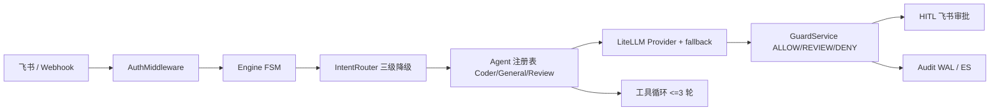

# Agent Gateway

企业级 Agent 网关：智能路由省钱 + 安全守卫/HITL + 评估体系，附 GitHub PR 审查垂直应用。

项目基于 FastAPI 自研状态机编排，不依赖 LangChain/LangGraph；LLM 调用层使用 LiteLLM 支持多 Provider、fallback 与成本统计。

## 架构



请求链路：飞书/Webhook → 鉴权 → 限流 → FSM → 意图路由（正则 → 微模型 → 路由 LLM）→ Agent 执行 → 静态评估 → 守卫策略 → HITL/拦截 → 渠道适配 → 审计日志。

## 三大卖点

### 1. 智能路由省钱

- 三级降级意图路由：正则命中直接返回，不调 LLM；只有低置信度才升级到微模型/路由模型。
- LiteLLM 内核：`chat` / `chat_with_tools` 接口保持兼容，内置多模型 fallback，网络/429/5xx 自动切换。
- 每次调用记录 `model_used`、`cost_usd`、`llm_latency_ms`、`fallback_used`，随审计日志落盘。
- Eval 实测（`evals/datasets/intent.jsonl`，50 条）：意图准确率 1.0，其中 **46 条（92%）由正则直接命中，0 次 LLM 调用**，只有 4 条落到模型兜底路径。

| 路由层级 | 说明 | 50 条用例命中 |
|---|---|---|
| 正则 | 0 LLM 调用，毫秒级返回 | 46（92%） |
| 微模型 / 路由 LLM | 正则未命中时升级 | 4（8%） |

每次真实调用的成本都会写入审计日志 `cost_usd` 字段，可据此按周聚合实际节省金额。

### 2. 安全守卫 + HITL

- 策略引擎覆盖内网 IP、密钥/Token、价格承诺，输出命中 `deny` 直接拦截，`review` 进入人工审批。
- 高危操作（如 `execute_code`）强制 REVIEW，飞书审批卡片闭环：通过送达、拒绝丢弃。
- 红队实测：200 条对抗用例，期望拦截 120 条全部命中，漏网 0，误拦截 0，召回率/精确率 100%。

运行红队：

```bash
uv run python scripts/redteam/run_redteam.py
```

### 3. 自建 Eval 评估体系

每次改动可以跑三类评估并输出 JSON 报告：

```bash
uv run python evals/run_evals.py --offline
```

| 维度 | 数据量 | 当前指标 |
|---|---|---|
| Intent 意图路由 | 50 条 | 准确率 1.0 |
| Guard 守卫对抗 | 50 条 | deny 召回 1.0 / 精确率 1.0，review 召回 1.0 |
| E2E 端到端 | 30 条 | offline 标记 skipped，CI 不依赖网络 |

红队基线（`scripts/redteam/cases.json`，200 条）：

| 维度 | 数据量 | 当前指标 |
|---|---|---|
| 越狱 / 注入 / 诱导 | 150 条 | 期望拦截 120 条全部命中，漏网 0 |
| 正常对照 | 50 条 | 误拦截 0 |
| 汇总 | 200 条 | 召回率 1.0 / 精确率 1.0 / 误拦截率 0.0 |

报告写入 `evals/reports/latest.json`，包含 `git_sha`、混淆矩阵、拦截指标和 e2e 均分/延迟/成本；intent 准确率低于 0.9 或 guard deny 召回低于 0.95 时退出码非零。

## PR 审查垂直应用

内置 GitHub PR 多 Agent 审查流水线：Triage → 静态分析 → 语义 RAG → 测试覆盖 → 汇总报告。

- Webhook 演示路径：`POST /webhook/github/review`（GitHub webhook body）
- 网关指令：发送 `/review` 后输入 `owner/repo#PR号`
- 无 `GITHUB_TOKEN` 时返回优雅降级文案，不会崩溃

审查结果包含严重级别统计、建议结论和摘要文本，`need_human_review` 时会走守卫/HITL 审计闭环。

## 快速开始

```bash
cd moa-gateway

python -m venv .venv
.venv\Scripts\activate          # Windows
# source .venv/bin/activate     # Linux / macOS

pip install uv
uv sync --all-extras --dev

cp .env.template .env           # 填入真实配置
.venv\Scripts\python.exe -m uvicorn app.main:app --host 0.0.0.0 --port 8080
```

访问：

- 管理后台：<http://localhost:8080/dashboard>
- 健康检查：<http://localhost:8080/health>
- 依赖级健康检查：<http://localhost:8080/healthz>

## 测试与质量

```bash
# 单元测试
.venv\Scripts\python.exe -m pytest tests/unit -q

# 静态检查
uv run ruff check .

# 安全扫描
uv run bandit -r app -q -s B105,B107,B110,B112,B324

# 评估冒烟
uv run python evals/run_evals.py --offline
```

GitHub Actions CI 会依次执行 pytest、ruff、bandit 和 eval offline；Docker 镜像使用 `python:3.12-slim` + uv 构建。

## 为什么不用 LangChain/LangGraph

核心编排是自研 FSM：状态转移可控、依赖面小、便于学习与面试讲解。多 Agent 网关最需要的是稳定的路由、守卫、审计闭环，而不是再套一层编排框架；LLM 调用层交给 LiteLLM 统一 Provider/fallback/成本即可。

## 简历条目草稿

> **agent-gateway**（FastAPI · Redis · LiteLLM · OpenTelemetry）
> - 三级降级意图路由 + Provider fallback，微模型分流简单请求，Eval 实测 50 条用例中 46 条正则直出（0 LLM 调用），成本随审计日志逐次核算。
> - 策略守卫 + RBAC + 飞书 HITL 审批闭环，红队 200 条对抗用例召回率/精确率 100%。
> - 自建 Eval 体系（150 条数据集 + LLM-as-judge），每次改动离线回归出 JSON 报告。
> - 后端工程：鉴权中间件、Redis 状态栈/Lua 锁、审计 WAL、OTel 链路、Docker + CI。
> - 垂直应用：GitHub PR 多 Agent 代码审查（Triage → 静态分析 → 语义 RAG → 测试覆盖 → 报告）。

## 已知边界

- `app/vectordb` 目前是中文 bigram 关键词检索，不是真向量库；语义 RAG 位于 PR 审查子应用。
- Redis 不可用时回退内存存储，内存回退也支持幂等锁脚本（acquire/release/extend + TTL），但只保证单进程内语义。
- 限流器为内存滑窗实现，适合单机开发；多实例需换 Redis 限流。
- `app/memory.py` 的 `_SyncBridge` 同步桥是已知技术债：同步线程跑 asyncio loop，测试与运行时都不依赖它做时序保证。
- `app/main.py` 使用 FastAPI lifespan 管理启动/关闭钩子（`on_event` 已迁移）。
- 所有密钥通过环境变量注入，`.env`、`logs/`、`data/`、`evals/reports/` 不入库。
