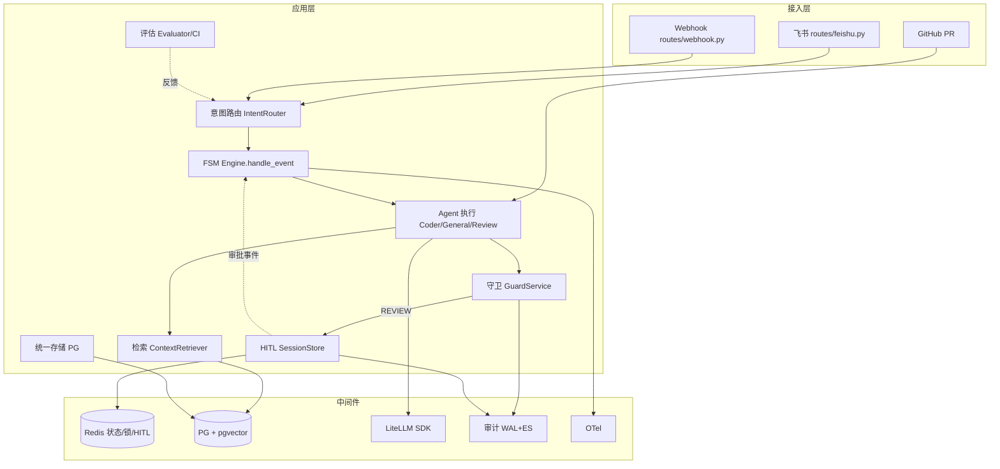
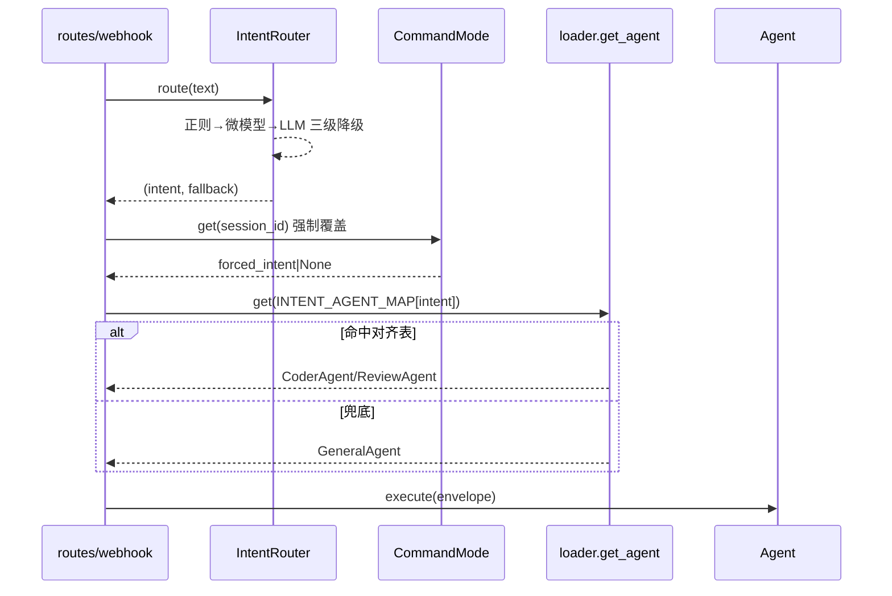
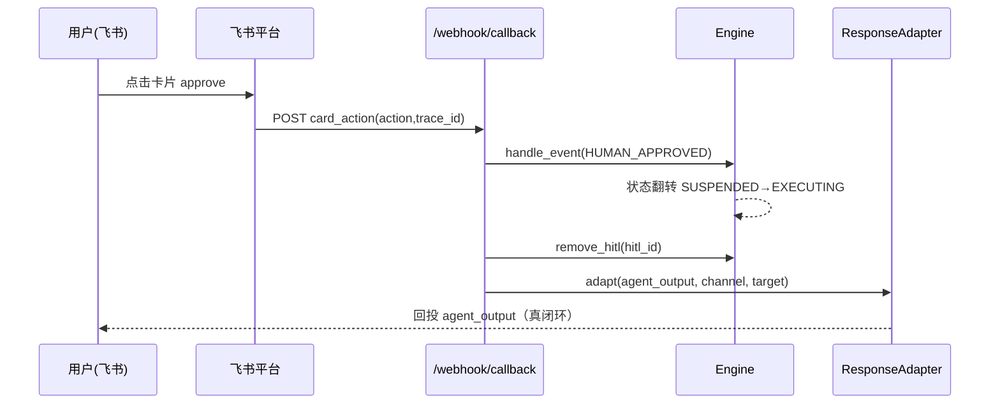
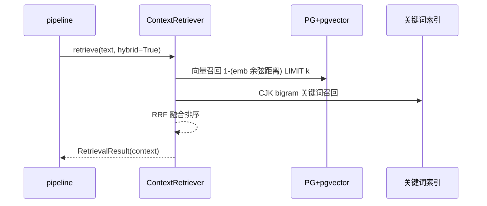
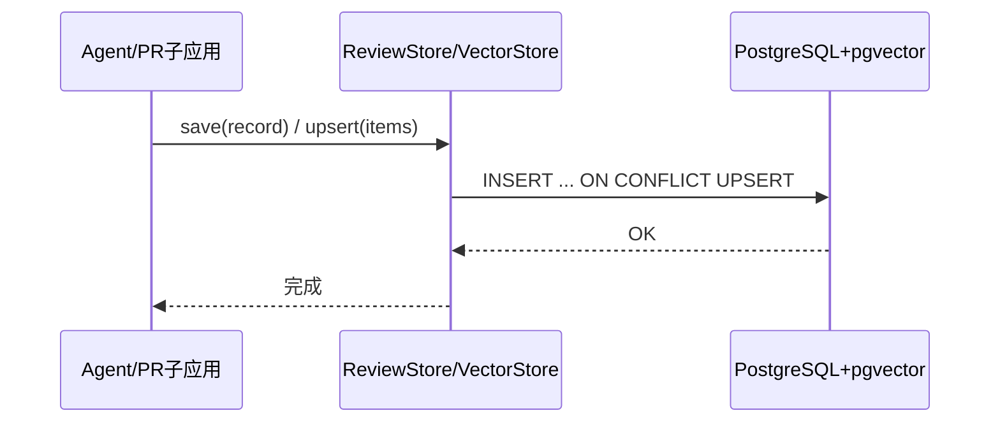
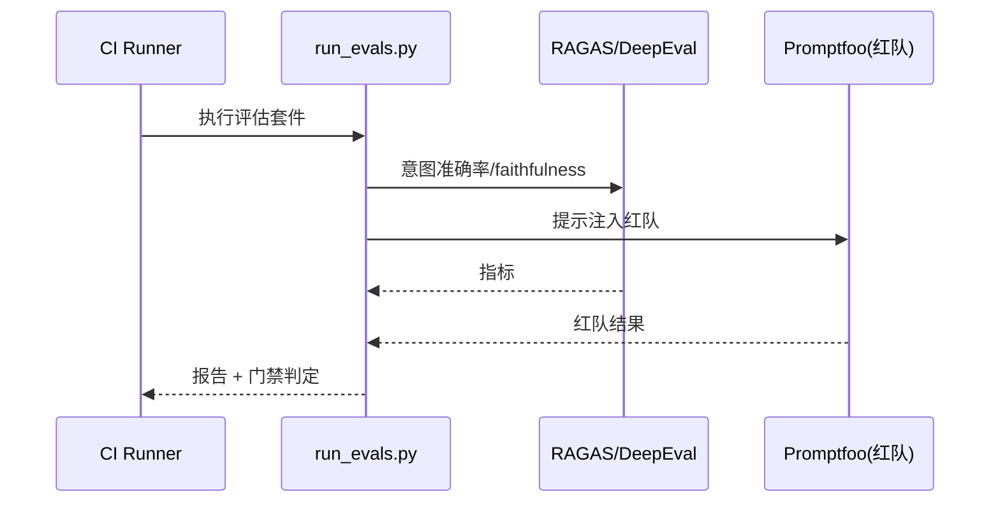
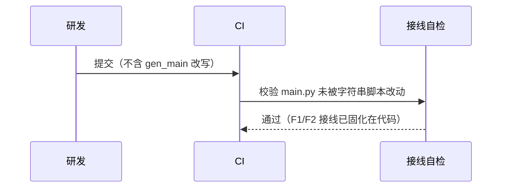
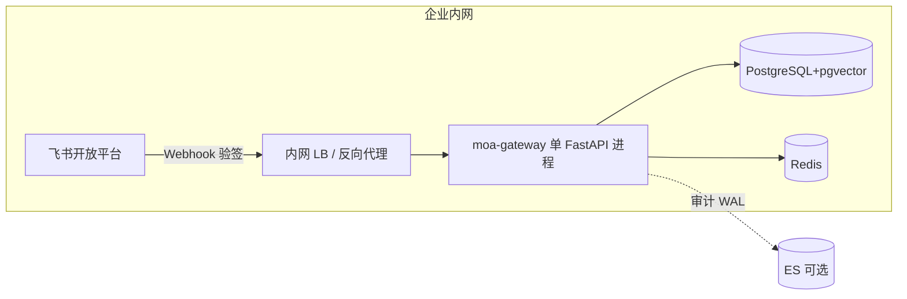

# AICoding 架构设计 · 系统设计

> ⚠️ **历史文档（2026-08，未按此实施）**：本文档是 AICoding 文档流水线的产物，用于架构推演。
> 其中**技术选型与评估框架的若干条**（RAGAS / DeepEval / Promptfoo、Prometheus / Grafana 等）
> 在代码里**没有任何引用**——实际落地的是自研 harness（`evals/`）+ 审计 WAL + dashboard。
> 当前口径以 `定位与减法清单.md`、README 与 `docs/adr/` 为准；保留本文档是为了记录推演的来路。

> 本文档为《AICoding 架构设计》核心产物之一，对应**系统架构设计模板**（`系统设计.md`）。
> 上游输入：《高层架构设计》（G3 已通过，业务边界冻结）、《资料摘要 material_digest.md》（G1 已通过，根因 A~F 与冲突 X1~X3）、《行业调研报告 research_report.md》（G2 已通过，选型参考）。
> 下游输出：驱动《部署设计》《安全设计》《UserStory》的实施；本环境 G5 部署/安全未交付，故 G4 通过后直接进入 Phase 6 集成交付。
> Owner：system-architect（高见远）。本文档仅在《高层架构设计》已冻结的业务边界（D1~D5、In/Out-of-Scope、MVP F1~F7、痛点→目标映射）内做接口 / 模块 / 数据层细化，不扩大业务范围、不推翻已冻结决策。

---

## 0. 元信息：修订记录

> 记录文档版本、变更内容、修订人、修订时间，确保设计文档的可追溯。

| 文档版本 | 发布日期 | 修订人 | 修订说明 |
| --- | --- | --- | --- |
| v1.0 | 2026-08-29 | 高见远（system-architect） | 初稿：单服务进程内应用架构、F1~F7 模块详细设计、§3.5 接口契约、统一 PG 数据库设计、可观测与合规安全底线 |

**填写要求**：每次评审通过新增一行；修订说明必须能定位到具体章节（本版为初始冻结版，对应 G4 中游设计审核）。

**裁剪声明（模板 §0 约定）**：
- 未启用：**§3.4 跨模块公共能力**（理由：本项目为单进程 FastAPI 服务，模块间复用以函数/单例注入实现，无横切 SDK/AOP 公共能力，整节略过）。
- 未启用：**§6 网络架构**（原模板 §6；理由：本期 G5 部署/安全整体未交付，网络结论并入 §5 部署架构与 §7 安全设计，不单列，本章仅留占位说明）。
- 略过章节后，后续章节序号顺延已体现：§5 部署 → §6 网络（略过）→ §7 安全 → §8 可观测。

---

## 1. 引言

### 1.1 文档目标

- **一句话定位**：本文档定义 moa-gateway（企业级 Agent 网关，单 FastAPI 服务）在交付物中的所有架构设计相关产物，重点回答用户最关心的**模块集成与调用设计、数据流转与状态管理、接口规范**。
- **读者对象**：架构师 / 开发 / 运维 / 安全 / 评审委员会。
- **设计范围**：业务架构（引用高层 §5）+ 应用架构（模块拆分与调用）+ 数据库设计（统一 PG 关系+向量）+ 部署架构（精简）+ 安全设计（合规底线，精简）+ 可观测设计。
- **非目标**：不做多 Agent 复杂编排 runtime（R6 延后）、不做 Dify/n8n/Rasa 平台替换、不重写骨架、不做跨云多租户、不做完整安全/部署设计（G5 未交付）。

### 1.2 关联文档清单

| 输入类型 | 内容要点 | 在本文档中的用途 | 形式 |
| --- | --- | --- | --- |
| 业务需求（高层架构设计） | 业务定位、角色、场景、关键流程、MVP F1~F7、In/Out-of-Scope、D1~D5 决策 | 第 2 章业务架构、第 3 章模块边界 | 外部文档（`.workbuddy/output/高层架构设计.md`） |
| 非功能性需求（高层 §6.1 N1~N5） | 单租户内网、审计 100%、集成测试真实化 ≥80%、复用不重写、HITL 闭环 100% | 第 3.5 / 4.1 / 5 / 7 章 | 外部文档 |
| 根因与冲突（资料摘要） | A 意图键不匹配 / B 飞书假闭环 / C 检索全空 / D 双 schema / E 脚本改写 / F monkeypatch；X1 双 schema、X2 闭环路径、X3 入口语义 | 第 3.2 / 3.5 / 4 章修复点定位 | 外部文档（`.workbuddy/output/material_digest.md`） |
| 选型参考（调研报告） | RAGAS/DeepEval/Promptfoo、pgvector、自研映射表、保留三级降级 | 第 3.1.5 / 3.2.M5 / 3.5 章 | 外部文档（`.workbuddy/output/research_report.md`） |
| 现有代码基线（仓库） | `app/`（网关核心）、`apps/code_review_pipeline/`（PR 子应用）、`scripts/`（9 个字符串改写脚本） | 第 3.2 / 3.5 章接口与文件:行号引用 | 本文档自带（逐文件核对） |

### 1.3 名词与术语表

> 业务名 ↔ 代码对象 ↔ 数据表 三层映射的唯一索引（用户要的接口规范基础）。

| 业务术语 | 业务定义（≤ 30 字） | 应用层核心对象（§3.3 O-xx） | 数据库表名（§4.2） |
| --- | --- | --- | --- |
| 意图标签（Intent Label） | 路由层输出的语义类别，如 coding/translate | `IntentLabel`（字符串枚举） | 不落表（运行时态，见 `moa_audit_wal` 审计） |
| 注册键 / Agent 键（Agent Key） | `AGENT_REGISTRY` 的键，如 coder/general/review | `AgentKey`（字符串） | 不落表（注册表内存态） |
| 路由键对齐表（Route Alignment） | 意图标签 → 注册键的同构映射 | `INTENT_AGENT_MAP`（dict） | 不落表（配置常量） |
| Agent 信封（AgentEnvelope） | 传给 Agent 执行的统一输入结构 | `O-01 AgentEnvelope` | 不落表（临时对象） |
| HITL 请求（HitlRequest） | 待人工审批的输出与上下文 | `O-04 HitlRequest` | `moa_hitl_requests`（Redis 为主，§4.2 可选 PG） |
| HITL 状态（HitlState） | FSM 状态机中人工审批相关态 | `O-05 HitlState`（`State` 枚举） | 不落表（FSM 内存态 + 审计） |
| PR 评审记录（ReviewRecord） | 一次 PR 审查的结构化结果 | `O-06 ReviewRecord` | `code_review_prs` |
| 审查发现（Finding） | PR 中单条问题（严重度/类别） | `AgentFindingResult` | `code_review_findings` |
| 向量文档（VectorDocument） | 带 embedding 的知识/会话片段 | `O-07 VectorDocument` | `code_review_vectors`、`moa_documents` |
| 检索结果（RetrievalResult） | 向量+关键词混合检索的拼接上下文 | `O-08 RetrievalResult` | 不落表 |
| 出站响应（OutboundResponse） | 适配到渠道的最终回复 | `O-09 OutboundResponse` | 不落表 |
| 管道结果（PipelineResult） | `pipeline.run()` 一次执行结果 | `O-10 PipelineResult` | 不落表（计入审计 WAL） |

---

## 2. 业务架构

> 本章回答：系统服务什么业务、业务由哪些场景构成、关键流程长什么样。详细业务全景、限界上下文、用例与流程图引用《高层架构设计》§5（业务架构设计），本章仅做冻结边界内的精炼与衔接，不重复展开。

### 2.1 业务架构概览

#### 2.1.1 业务全景图

**业务域清单**（与第 3 章模块、第 4 章数据库分组保持一致）：

| 业务域 | 核心场景 | 涉及角色 | 与其他业务域的关系 |
| --- | --- | --- | --- |
| 接入域（Ingress） | 飞书/Webhook/GitHub 流量入口与渠道适配 | 内部开发者、飞书终端用户 | 上游：飞书/GitHub；下游：意图路由 |
| 路由与编排域（Routing & FSM） | 三级意图路由、FSM 状态机、命令模式 | 内部开发者 | 上游：接入域；下游：Agent 执行 |
| Agent 执行域（Agent） | Coder/General/Review 三 Agent 经 LiteLLM 执行 | 内部开发者 | 上游：路由；下游：守卫/检索 |
| 守卫与 HITL 域（Guard & HITL） | 内网IP/密钥/RBAC/红队、人工审批闭环 | 运维、终端用户、合规 | 上游：Agent；下游：渠道回投/审计 |
| 检索与知识域（RAG） | 轻量向量+关键词混合检索 | 内部开发者 | 上游：Agent；依赖：PG+pgvector |
| 存储与数据域（Storage） | 统一 PG 关系+向量、审计 WAL | 运维、合规 | 被全链路消费 |
| 评估与运营域（Eval/Ops） | RAGAS/DeepEval/Promptfoo 评估、CI 门禁、看板 | 运维、甲方决策者、合规 | 反馈至路由/Prompt 注册表 |

### 2.2 领域关系映射

#### 2.2.1 限界上下文清单

| 限界上下文 | 对应业务域 | 域类型 | 覆盖的核心业务实体 | 上下文边界（属于本域 vs 不属于） |
| --- | --- | --- | --- | --- |
| BC-Ingress | 接入域 | 支撑域 | `ChannelMessage`、`MoAEvent` | 属于：飞书/Webhook 适配；不属于：业务编排 |
| BC-Routing | 路由与编排域 | 核心域 | `IntentLabel`、`AgentKey`、`State` | 属于：意图→Agent 分发；不属于：模型执行 |
| BC-Agent | Agent 执行域 | 核心域 | `AgentEnvelope`、`ReviewRecord` | 属于：Coder/General/Review 执行；不属于：渠道回投 |
| BC-Guard | 守卫与 HITL 域 | 核心域 | `HitlRequest`、`HitlState`、`GuardVerdict` | 属于：审批闭环与守卫；不属于：检索 |
| BC-RAG | 检索与知识域 | 支撑域 | `VectorDocument`、`RetrievalResult` | 属于：混合检索；不属于：PR 子应用专属存储 |
| BC-Storage | 存储与数据域 | 通用域 | `ReviewRecord`、`VectorDocument`、审计条目 | 属于：统一 PG；不属于：业务编排语义 |
| BC-Eval | 评估与运营域 | 通用域 | 评估指标、Golden Dataset | 属于：CI 门禁；不属于：线上实时链路 |

**域类型说明**：核心域（BC-Routing/BC-Agent/BC-Guard）= 业务护城河，投入最多；支撑域（BC-Ingress/BC-RAG）= 必要但可外采/复用；通用域（BC-Storage/BC-Eval）= 优先复用。

#### 2.2.2 上下文映射（Context Mapping）

| 关系编号 | 上游上下文 | 下游上下文 | 关系模式 | 同步方式 | 选择理由 |
| --- | --- | --- | --- | --- | --- |
| C-01 | BC-Ingress | BC-Routing | Customer/Supplier | 同步 API（HTTP 入站） | 接入域按 Routing 需求节奏交付事件 |
| C-02 | 飞书开放平台（外部） | BC-Ingress | ACL（防腐层） | Webhook + 验签 | 飞书模型不污染本域，自建 `FeishuChannelAdapter` |
| C-03 | BC-Routing | BC-Agent | Customer/Supplier | 进程内函数调用 | 路由结果直接驱动 Agent 分发 |
| C-04 | BC-Agent | BC-Guard | Customer/Supplier | 进程内调用 | 守卫评估 Agent 输出 |
| C-05 | BC-Storage | BC-RAG / BC-Agent | Shared Kernel | 共享 DTO / SQL | 统一 PG 承载关系+向量，schema 共享 |
| C-06 | BC-Eval | BC-Routing | Published Language | CI 事件 / 指标报告 | 评估反馈以标准指标驱动 Prompt/路由优化 |

**关系模式说明**（见模板）：Customer/Supplier（上下游强协作）、ACL（对接外部不可控系统必建防腐层）、Shared Kernel（共享内核，本例为统一 PG schema）、Published Language（上游以标准协议/指标对外）。

#### 2.2.3 跨域协作原则

| 原则编号 | 原则 |
| --- | --- |
| P-01 | 核心域（BC-Routing/BC-Agent/BC-Guard）禁止反向依赖支撑/通用域的内部模型 |
| P-02 | 核心域之间禁止直接耦合，必须经事件 / 函数调用解耦（FSM `Engine.handle_event` 为唯一状态中枢） |
| P-03 | 对接外部不可控系统（飞书/GitHub）必须建 ACL 防腐层，禁止把外部模型贯穿到本域 |

### 2.3 详细业务架构

#### 2.3.1 用例图

**用例图清单**（引用高层 §5.1 业务架构图与 §6 产品原型）：

| 编号 | 用例图标题 | 涉及业务域 | 源文件位置 |
| --- | --- | --- | --- |
| UC-01 | 开发者经飞书提交 Agent 请求并被正确分发 | BC-Ingress/BC-Routing/BC-Agent | 高层架构设计 §5.1 |
| UC-02 | 飞书 HITL 审批真闭环 | BC-Guard | 高层架构设计 §6.4 |
| UC-03 | PR 自动审查并持久化 | BC-Agent/BC-Storage | 高层架构设计 §6.2 |
| UC-04 | 运维看板与评估门禁 | BC-Eval | 高层架构设计 §6.5 |

#### 2.3.2 业务流程图

**关键流程清单**（核心业务覆盖度 ≥ 80%）：

| 流程编号 | 流程名 | 起点 | 终点 | 涉及业务域 | 源文件位置 |
| --- | --- | --- | --- | --- | --- |
| BF-01 | 主链路：意图→Agent→守卫→HITL→回投 | 飞书/Webhook 入站 | 渠道回投 agent_output | BC-Ingress→BC-Agent→BC-Guard | `app/pipeline.py:78` |
| BF-02 | 飞书 HITL 真闭环 | 卡片 action | `/webhook/callback` 回投 | BC-Guard | `app/routes/webhook.py:16` |
| BF-03 | PR 审查子应用 | GitHub Webhook | PG 持久化 | BC-Agent/BC-Storage | `apps/code_review_pipeline/` |

### 2.4 业务范围与边界

> 本节边界直接冻结自《高层架构设计》§6.1，仅做引用衔接，不重新裁决。

#### 2.4.1 功能模块清单

| 编号 | 一级功能名 | 子功能描述 | 对应业务域 | 实现状态 |
| --- | --- | --- | --- | --- |
| F1 | 意图↔Agent 注册键对齐 | 自研映射表，消除键不匹配 | BC-Routing | MVP 必做 |
| F2 | 飞书 HITL 真闭环 | 回调指向 /webhook/callback，状态翻转+回投 | BC-Guard | MVP 必做 |
| F3 | 真向量 RAG 轻量版 | pgvector + 向量/关键词混合，离线回退 | BC-RAG | MVP 轻量 |
| F4 | 统一 Postgres | 合并 code_review_prs 与 code_review_vectors | BC-Storage | MVP 必做 |
| F5 | 评估体系 + CI 门禁 | RAGAS/DeepEval/Promptfoo，去 monkeypatch | BC-Eval | MVP 必做 |
| F6 | 停用字符串改写脚本 | gen_main 等停用，接线回归 | BC-Ingress/BC-Routing | MVP 必做 |
| F7 | 接口规范与调用设计 | 冻结下游 G4 接口边界 | 全部 | MVP 必做 |
| N1 | 单租户内网部署 | 私有化企业内网 | — | MVP |
| N2 | 审计留痕 100% | 关键操作写 WAL | BC-Storage | MVP |
| N3 | 集成测试真实化 ≥80% | 去 monkeypatch | BC-Eval | MVP |

**In-Scope（本期范围内）**：F1~F7、N1~N3（共 10 条，≤15）。

**Out-of-Scope（本期不做）**：

| 编号 | 不做的事项 | 不做的原因 | 未来归属 |
| --- | --- | --- | --- |
| O1 | 多 Agent 复杂编排 runtime（supervisor 多级） | MVP 先跑通分发与闭环，多级协作为增强项（D1） | 完整版（R6） |
| O2 | Dify / n8n / Rasa 平台级替换 | 违背"复用现有代码、避免大规模重写"冻结约束 | 不做（否决） |
| O3 | 大规模重写（推倒自研骨架） | 框架已搭、仅逻辑未通，重写返工大 | 仅修正接线 |
| O4 | 跨云多租户 | 本期定位企业内网单租户（N1） | 后续版本按需评估 |

### 2.5 质量与柔性可用

#### 2.5.1 服务质量目标

**质量目标 Top 3-5**（按 ISO 25010 排序）：

| 优先级 | 质量目标 | 业务驱动 | 受影响的关键章节 |
| --- | --- | --- | --- |
| Q1 | 正确性：意图→Agent 分发正确率 100% | 根因 A 直接失效 | §3.2.M1 / §3.5(a) |
| Q2 | 闭环性：飞书 HITL 审批真闭环率 100% | 根因 B 合规底线 | §3.2.M2 / §3.5(b) |
| Q3 | 可测试性：真实接线集成测试 ≥80% | 根因 F CI 失真 | §3.2.M5 / §3.5(f) |
| Q4 | 可观测性：审计 WAL 覆盖率 100% | N2 合规 | §8 |

**可验证质量场景**：

| 场景编号 | 关联目标 | 触发源 | 触发条件 | 期望响应 | 度量指标 |
| --- | --- | --- | --- | --- | --- |
| QS-01 | Q1 | 内部开发者提交 coding 意图 | 命中 `/coding` 或正则 coding | CoderAgent 被选中并执行 | 分发正确率 = 100% |
| QS-02 | Q2 | 用户点击飞书审批"批准" | 卡片 action=approve | agent_output 真正回投 | 闭环率 = 100%，P99 ≤ 5s |
| QS-03 | Q3 | CI 跑评估套件 | 集成测试覆盖关键路径 | 真实 get_agent/真实闭环端点 | 真实集成测试占比 ≥80% |

#### 2.5.2 业务柔性可用策略

**业务功能优先级分层**：

| 层级 | 含义 | 故障态下的处置方向 | 用户感知 |
| --- | --- | --- | --- |
| L0 核心业务 | 意图分发、HITL 闭环、审计 | 不降级，优先消耗所有资源 | 无 / 极轻微 |
| L1 重要业务 | RAG 检索、PR 审查 | 限流 + 异步化 | 检索变慢/返回兜底 |
| L2 辅助业务 | 评估看板、Prompt 金丝雀 | 关闭 / 返回兜底 | 部分功能不可用 + 提示 |
| L3 附加业务 | 趋势归因、知识浮层 | 直接关闭 + 异步补偿 | 通常无感 |

**业务降级清单**：

| 编号 | 关联功能 | 触发条件 | 降级动作 | 用户感知 | 决策类型 |
| --- | --- | --- | --- | --- | --- |
| BD-01 | F3 RAG | embedding API 不可用（U-01 触发） | 关键词检索兜底，关闭向量召回 | 召回变少但仍有结果 | 自动 |
| BD-02 | F4 存储 | PG 不可用 | 内存回退（SQLite/内存，仅本地） | 重启后数据可能丢失（明确告警） | 自动 |
| BD-03 | F2 HITL | 飞书凭证缺失 | REVIEW 只挂起不发卡，管理员轮询 | 需人工后台处理 | 自动 |

---

## 3. 应用架构

> 本章为系统设计核心，占全文约 45%。回答：系统由哪些模块组成、模块与外部系统怎么集成、每个模块的内部交互链路是什么。

### 3.1 应用架构概览

#### 3.1.1 系统上下文

**系统上下文要素清单**（本系统画为单一 FastAPI 进程节点，内部组件归 §3.1.2）：

| 节点类型 | 节点名 | 与本系统的关系 | 关系语义 |
| --- | --- | --- | --- |
| 角色 | 内部开发者 | 使用 | 经飞书/Webhook 提交请求 |
| 角色 | 运维 / SRE | 使用 | 看板、干预、排障 |
| 角色 | 终端用户（被服务方） | 使用 | 经飞书触达获取答复 |
| 角色 | 合规 / 安全 | 使用 | 审计复核、越权拦截 |
| 上游平台 | 飞书开放平台 | 推送 → 本系统 | 消息/卡片 action 回调 |
| 上游平台 | GitHub | 推送 → 本系统 | PR 事件 |
| 外部业务系统 | 模型 Provider（经 LiteLLM） | 本系统 → 调用 | 多模型推理 |
| 下游平台 | 审计 / 监控平台 | 本系统 → 推送 | WAL/OTel |

#### 3.1.2 系统模块图

**分层组件清单**（单进程内模块，进程间依赖走 SDK/Webhook）：

| 层次 | 内容 | 数据来源 |
| --- | --- | --- |
| 接入层 | 飞书渠道（`routes/feishu.py`）、Webhook 渠道（`routes/webhook.py`）、GitHub PR（`apps/.../routing`） | §2.3 用例图角色 |
| 应用层 | 意图路由（`router/intent_router.py`）、FSM（`engine.py`/`fsm/`）、Agent（`agents/`）、守卫（`guard/`）、HITL（engine SessionStore）、检索（`vectordb/`、`knowledge.py`）、统一存储（`apps/.../storage`、`rag/vector_store.py`）、评估（`evaluator/`、`evals/`） | §2.1 业务域 |
| 中间件层 | PostgreSQL+pgvector、Redis（状态栈/锁/HITL）、LiteLLM（进程内 SDK）、审计 WAL+ES、OTel | §3.1.3 云组件清单 |
| 集成对接层 | 飞书 SDK 封装（`channels/feishu*.py`）、GitHub REST、评估框架 CLI | §3.1.3 外部依赖清单 |

**模块调用总览图**（接入 → 路由 → FSM → Agent → 守卫 → HITL → 检索 → 存储 → 审计）：



#### 3.1.3 集成架构

##### 外部依赖清单

| ID | 外部系统 | 归属团队 / 供应商 | 类别 | 使用方式 | 集成方式 | 协议 / 版本 | 功能定位（≤ 30 字） | 联系人 |
| --- | --- | --- | --- | --- | --- | --- | --- | --- |
| E-01 | 飞书开放平台 | 飞书 | 第三方业务平台 | 消费+生产 | Webhook + 验签 | HTTPS / 卡片回调 | 消息收发与审批卡片 | @运维 |
| E-02 | GitHub | GitHub | 业务协作 | 双向 | Webhook + REST | v3 | PR 事件与代码获取 | @子应用研发 |
| E-03 | 模型 Provider | LiteLLM 上游 | 第三方业务平台 | 消费 | SDK（进程内） | LiteLLM 1.96.2 | 多模型推理/回退/计量 | @平台研发 |
| E-04 | 评估框架 | RAGAS/DeepEval/Promptfoo | 监控审计 | 生产 | CLI/SDK（CI） | RAGAS 0.2x/DeepEval 2.x/Promptfoo 0.9x | 意图准确率/faithfulness/红队 | @质量研发 |

##### 云组件 / 基础设施清单

| ID | 组件类别 | 选型 | 部署形态 | 规格量级 | 容量预估 | 提供方 / SLA | 用途 |
| --- | --- | --- | --- | --- | --- | --- | --- |
| C-01 | 关系型+向量数据库 | PostgreSQL 16.0 + pgvector 0.7 | 单实例（同库） | 2C8G 起 | 百万级向量+关系 | 企业内网 PG | 关系+向量统一存储（F4） |
| C-02 | 缓存/状态 | Redis 7.0 | 单实例 | 2C4G | 内存态 HITL/锁 | 企业内网 | 状态栈/Lua 锁/HITL 挂起 |
| C-03 | 多模型代理 | LiteLLM 1.96.2 | 进程内 SDK | 随服务 | 调用 QPS | 自研集成 | 模型调用/回退/计量 |
| C-04 | 审计/检索增强 | Elasticsearch（可选） | 单实例（可选） | — | 审计索引 | 可选 | WAL 双写/检索（N2） |
| C-05 | 可观测 | OpenTelemetry + Prometheus/Grafana | 单实例 | — | 指标/链路 | 企业内网 | 指标/链路/看板（§8） |

**填写要求**：选型含具体产品+版本号（见上表 C-01~C-05）；不使用的组件整行删除（无 Kafka/MQ，因 D1 §1.9 明确无 MQ，Redis 仅作状态栈非 MQ）。

##### 组件依赖关系

| 业务模块（§3.2） | 依赖的外部系统（E-xx） | 依赖的云组件（C-xx） | 故障传导风险 |
| --- | --- | --- | --- |
| M1 意图路由 | E-03 | — | E-03 超时 → 路由降级到正则/默认 |
| M2 飞书 HITL 闭环 | E-01 | C-02 | E-01 凭证缺失 → 只挂起不发卡（BD-03） |
| M3 检索/RAG | — | C-01 | C-01 不可用 → 检索空，走兜底（BD-02） |
| M4 统一存储 | — | C-01 | C-01 不可用 → 内存回退，重启丢数据 |
| M5 评估/CI | E-04 | — | E-04 失败 → CI 门禁阻断合入（反制 F） |
| M6 接入/守卫 | E-01/E-02 | C-02 | C-02 不可用 → 内存回退 |

#### 3.1.4 工程结构

```
moa-gateway/
├── app/                      # 网关核心（单 FastAPI 服务）
│   ├── main.py               # 入口 + lifespan（挂载路由/中间件）
│   ├── deps.py               # 全局单例装配中心
│   ├── pipeline.py           # 主链路编排 MoAPipeline.run()
│   ├── engine.py             # FSM + HITL 存储（SessionStore/HitlRequest）
│   ├── router/               # 三级意图路由 intent_router.py / llm_classifier.py
│   ├── agents/               # Coder/General/Review 三 Agent + contract.py + loader.py
│   ├── guard/                # 守卫 policies/rbac/redteam/guard_service
│   ├── channels/             # 飞书自研收发/验签/卡片
│   ├── vectordb/             # 检索客户端 + ContextRetriever
│   ├── knowledge.py          # 知识库（接 PG）
│   ├── memory.py             # 会话记忆（Redis）
│   ├── redis_state/          # 状态栈/Lua 锁
│   ├── audit/                # 审计 WAL + ES 双写
│   ├── evaluator/            # 规则评估（AST 护栏）
│   ├── observability/        # OTel
│   ├── middleware/            # auth.py 鉴权
│   └── routes/               # feishu.py / webhook.py / health / dashboard / knowledge
├── apps/
│   └── code_review_pipeline/ # 垂直业务：GitHub PR 多 Agent 审查
│       ├── storage/          # schema.sql / review_store.py（统一 PG）
│       ├── rag/              # vector_store.py（统一 PG，弃 SQLite）
│       ├── agents/           # triage/static/semantic/test/report 五 Agent
│       └── routing/          # GitHub 路由
├── evals/                    # 评估数据集 + run_evals.py（CI 门禁）
├── scripts/                  # ⚠ F6：gen_main 等 9 个字符串改写脚本本期停用
└── tests/                    # 集成测试（去 monkeypatch，N3）
```

#### 3.1.5 技术选型（版本约束）

| 技术分类 | 选型 | 版本 | 备注 / 选型理由 |
| --- | --- | --- | --- |
| 后端语言 | Python | 3.12 | 选型理由：与现有 `pyproject.toml requires-python >=3.12` 一致，复用骨架不升版本 |
| Web 框架 | FastAPI | 0.111 | 选型理由：已落地 `app/main.py`，避免替换为其他框架，仅修正接线 |
| 进程内编排 | 自研 FSM + Pipeline | — | 选型理由：复用现有 `engine.py`/`pipeline.py`，吸收 LangGraph interrupt/resume 范式而非引入运行时 |
| 多模型代理 | LiteLLM | 1.96.2 | 选型理由：已在依赖，复用 fallback/cost，符合复用约束 |
| 关系型+向量存储 | PostgreSQL + pgvector | 16.0 + 0.7 | 选型理由：与现有 `schema.sql` 同库，运维零新增，向量与关系合一（F4/D3） |
| 缓存/状态 | Redis | 7.0 | 选型理由：已用于状态栈/HITL，无 REDIS_URL 时内存回退 |
| 检索范式 | 自研 ContextRetriever + pgvector | — | 选型理由：复用现有 `vectordb/retriever.py`，升级为向量+关键词混合 |
| 意图对齐 | 自研映射表（不引库） | — | 选型理由：优先消除键不匹配（A），参考 semantic-router 范式但零依赖 |
| 评估 | RAGAS / DeepEval / Promptfoo | 0.2x / 2.x / 0.9x | 选型理由：业界标准、CI 友好、覆盖 faithfulness/意图准确率/红队（F5） |
| 鉴权 | 自研 AuthMiddleware | — | 选型理由：已落地 `middleware/auth.py`，本期修复 fail-open（§7） |
| 可观测 | OpenTelemetry | 1.x | 选型理由：已在 `observability/`，补 traceId/tenantId 透传 |

**填写要求**：必须有版本号（上表已含）；选型理由用一句话说明为什么选 A 不选 B（见各"选型理由"列）。

### 3.2 模块详细设计

> 方法论：模块详细设计画的是业务逻辑在角色和系统之间流动的过程。先在 §3.2.1/§3.2.2 给出公共约束与模块清单，再按"五段式"逐模块展开（§3.2.M1~M6）。F7（接口规范）集中于 §3.5。

#### 3.2.1 模块公共约束（Common）

**通信方式约束**：

| 约束项 | 取值 |
| --- | --- |
| 接口路径风格 | RESTful（进程内为 Python 函数调用，HTTP 仅暴露接入层路由） |
| 协议 | HTTP（接入层）/ 进程内函数调用（应用层）/ Webhook（飞书/GitHub 回调） |
| 数据格式 | JSON（HTTP）/ Python dataclass（进程内） |
| 字符编码 | UTF-8 |

**通用基础结构**（进程内 DTO）：`AgentEnvelope`、`HitlRequest`、`RetrievalResult`、`OutboundResponse`、`PipelineResult`（见 §3.3）。

#### 3.2.2 模块清单与编号规则

**模块清单**（与 §2.1 业务域一致）：

| 编号 | 模块名 | 业务域（§2.1） | 模块负责人 | 关联子领域 |
| --- | --- | --- | --- | --- |
| M1 | 意图路由与 Agent 分发对齐（F1） | BC-Routing | @网关研发 | 路由/注册表 |
| M2 | 飞书 HITL 真闭环（F2） | BC-Guard | @网关研发 | 守卫/HITL |
| M3 | 检索与轻量 RAG（F3） | BC-RAG | @平台研发 | 检索/知识 |
| M4 | 统一存储与 Schema 合并（F4） | BC-Storage | @平台研发 | 存储 |
| M5 | 评估体系与 CI 门禁（F5） | BC-Eval | @质量研发 | 评估 |
| M6 | 接线回归与脚本停用治理（F6） | BC-Ingress/BC-Routing | @网关研发 | 治理 |
| M7 | 接口规范与调用设计（F7） | 全部 | @网关研发 | §3.5 |

**编号规则**：模块编号 `M{N}` 全局唯一，与 §2.1 业务域一致；每个模块在 §3.2 下独立成节，编号 `§3.2.M{N}`；节内五段式编号 `§3.2.M{N}.1`~`.5`。

#### 3.2.3 单模块设计模板（五段式）

本节定义各模块五段式格式（业务定位三要素 / 接口清单 / 关键结构 / 时序图 / 关键流程）。以下 §3.2.M1~M6 按此模板展开，五段顺序固定；无复杂状态机的模块在 `.5` 显式注明"无复杂状态机/事务/跨多步异步，本段省略"。

#### 3.2.M1 意图路由与 Agent 分发对齐（F1）

> 修复根因 A：`intent_router.py:27-37` 输出 coding/translate/...，注册表 `loader.py:4-11` 仅 coder/general/review，`pipeline.py:172` `get_agent(intent) or get_agent("general")` 使 CoderAgent 永不选中。

##### §3.2.M1.1 模块概述

- **位置**：接入层之后、FSM/Agent 之前，处于主链路 BF-01 的"识别"环节。
- **角色**：内部开发者（提交请求）、运维（观测命中率）。
- **内外部系统**：上游接入层（`routes/feishu.py`/`webhook.py`）、下游 `agents/loader.py` 注册表、`command_mode.py`；外部无。

##### §3.2.M1.2 接口清单

| 子领域 | 方法 | 路径/函数 | 用途（≤ 20 字） | 请求 DTO | 响应 VO | 幂等 |
| --- | --- | --- | --- | --- | --- | --- |
| 路由 | 函数 | `IntentRouter.route(text)` | 三级降级输出意图标签 | `str` | `tuple[str,str]` | 天然 |
| 对齐 | 函数 | `resolve_agent(intent) -> SubAgent` | 意图标签→Agent 分发 | `IntentLabel` | `SubAgent` | 天然 |
| 命令 | 函数 | `CommandMode.get/set` | 强制意图覆盖 | `session_id` | `str\|None` | 天然 |

##### §3.2.M1.3 关键结构定义（DTO）

```python
# 意图标签集合（与 llm_classifier.VALID_INTENTS 同构，intent_router.py:27-37）
INTENT_LABELS = {
    "coding", "translate", "summarize", "search",
    "analyze", "greeting", "debug", "control", "assistant",
}
# 注册键集合（agents/loader.py:4-11 注册 coder/general/review）
AGENT_KEYS = {"coder", "general", "review"}

# F1 核心：意图标签 → 注册键 同构对齐表（消除根因 A）
INTENT_AGENT_MAP: dict[str, str] = {
    "coding": "coder",
    "translate": "general",
    "summarize": "general",
    "search": "general",
    "analyze": "general",
    "greeting": "general",
    "debug": "general",
    "control": "general",   # 控制类走 passthrough，仍由 general 处理
    "assistant": "general",
    "review": "review",
}
```

| DTO / 常量 | 字段名 | 类型 | 必填 | 业务含义 | 约束 / 默认值 |
| --- | --- | --- | --- | --- | --- |
| `INTENT_AGENT_MAP` | key | str | 是 | 意图标签 | 必须 ∈ `INTENT_LABELS` |
| `INTENT_AGENT_MAP` | value | str | 是 | 注册键 | 必须 ∈ `AGENT_KEYS`（保证同构） |
| `IntentRouter.route` 返回 | fallback | str | 是 | 降级层级 | regex/micro_llm/router_llm/none |

##### §3.2.M1.4 模块逻辑时序图

**时序图清单**：

| 编号 | 标题 | 场景类别 | 是否包含异常分支 |
| --- | --- | --- | --- |
| SQ-01 | M1 - 意图识别与 Agent 分发 | 核心分发 | 是（三级降级+默认兜底） |



##### §3.2.M1.5 关键流程逻辑

```
触发：pipeline.run() 收到意图标签 intent（pipeline.py:168）

Step 1: 强制覆盖（命令模式）
  ├── forced = command_mode.get(session_id)  # command_mode.py:50
  └── 若 forced：intent = forced

Step 2: 对齐分发（修复 A 的关键）
  ├── key = INTENT_AGENT_MAP.get(intent, "general")   # 同构映射
  ├── agent = get_agent(key) or get_agent("general")    # loader.py:28
  └── agent_name = key if agent else "general"

Step 3: 异常分支
  └── 若 agent 为 None（注册表异常）：回退 general，记审计告警
```

#### 3.2.M2 飞书 HITL 真闭环（F2）

> 修复根因 B / 冲突 X2：`routes/feishu.py:69-96` 仅 `adp.send()` 回执不闭环；真正闭环在 `routes/webhook.py:16-65`，需让飞书卡片 action 回调指向 `/webhook/callback`。

##### §3.2.M2.1 模块概述

- **位置**：守卫判定 REVIEW 后 → 卡片发送 → 人工点击 → `/webhook/callback` → 回投。
- **角色**：终端用户（审批）、运维（监控挂起）、合规（审计）。
- **内外部系统**：飞书开放平台（E-01）、`engine.SessionStore`、`adapter.ResponseAdapter`、审计 WAL。

##### §3.2.M2.2 接口清单

| 子领域 | 方法 | 路径 | 用途（≤ 20 字） | 请求 DTO | 响应 VO | 幂等 |
| --- | --- | --- | --- | --- | --- | --- |
| 发卡片 | POST | （飞书消息 API） | 发送审批卡片 | `ApprovalCard` | `bool` | 否 |
| 闭环回调 | POST | `/webhook/callback` | 审批结果真闭环 | `card_callback` | `JSON` | 是（hitl_id） |
| 状态查询 | 函数 | `engine.handle_event` | FSM 状态翻转 | `MoAEvent` | `SessionState` | 天然 |

##### §3.2.M2.3 关键结构定义（DTO）

```python
# 卡片 action value（channels/feishu_cards.py:44-52）
# {"action": "approve"|"reject", "session_id": str, "trace_id": str}
# FSM 事件枚举（fsm/state_machine.py:22-23）
HUMAN_APPROVED = "HUMAN_APPROVED"
HUMAN_REJECTED = "HUMAN_REJECTED"
```

| DTO / VO | 字段名 | 类型 | 必填 | 业务含义 | 约束 / 默认值 |
| --- | --- | --- | --- | --- | --- |
| `ApprovalCard` | action | str | 是 | 批准/拒绝 | approve / reject（枚举） |
| `ApprovalCard` | session_id | str | 是 | 会话标识 | 非空 |
| `ApprovalCard` | trace_id | str | 是 | 追踪标识 | 非空 |
| `HitlRequest` | agent_output | str | 是 | 待审批输出 | 回投载体 |

##### §3.2.M2.4 模块逻辑时序图

**时序图清单**：

| 编号 | 标题 | 场景类别 | 是否包含异常分支 |
| --- | --- | --- | --- |
| SQ-02 | M2 - 飞书审批真闭环 | 回调/回投 | 是（hitl 未找到/状态翻转） |



##### §3.2.M2.5 关键流程逻辑

```
触发：用户点击飞书审批卡片 action（飞书回调本应指向 /webhook/callback）

Step 1: 解析回调（webhook.py:18-24）
  ├── parsed = parse_card_callback(body)  # session_id, trace_id, action
  └── 失败 → 400 invalid_callback_payload

Step 2: 取 HITL 请求（webhook.py:26）
  ├── hitl = engine.session_store.get_hitl(hitl_id)
  └── 未找到 → 404 hitl_request_not_found

Step 3: 状态翻转（webhook.py:30-40）
  ├── approve → FsmEvent.HUMAN_APPROVED
  ├── reject  → FsmEvent.HUMAN_REJECTED
  └── engine.handle_event(moa_event)  # engine.py:261-268 清 hitl_pending

Step 4: 结果回投（修复 B 核心，webhook.py:41-53）
  ├── remove_hitl(hitl_id)
  ├── response = adapter.adapt(hitl.agent_output, channel=hitl.channel, target=hitl.target)
  └── log_request(..., hitl_decision=action, hitl_duration_ms=...)
```

> **关键修复点**：`routes/feishu.py:69-96` 当前仅 `adp.send("已批准")` 回执；须改为：卡片 `value` 中回调地址统一指向 `/webhook/callback`（由飞书应用后台 Message Card Request URL 配置，U-03 已冻结回退），禁止在 `feishu.py` 内直接闭环。

#### 3.2.M3 检索与轻量 RAG（F3）

> 修复根因 C：`deps.py:35` `_retriever = ContextRetriever(VectorDBClient())` 内存 dict 重启清空，`pipeline.py:179` `retrieve()` 永远返回空。本期升级为 PG+pgvector 向量 + 关键词混合检索。

##### §3.2.M3.1 模块概述

- **位置**：Agent 执行前，`pipeline.py:179` 注入 `envelope.global_summary`。
- **角色**：内部开发者（提问）、运维（召回质量）。
- **内外部系统**：PG+pgvector（C-01）、embedding 模型（U-01 外联 API 或本地 FastEmbed）。

##### §3.2.M3.2 接口清单

| 子领域 | 方法 | 函数 | 用途（≤ 20 字） | 请求 DTO | 响应 VO | 幂等 |
| --- | --- | --- | --- | --- | --- | --- |
| 检索 | 函数 | `ContextRetriever.retrieve` | 混合检索返回上下文 | `query` | `RetrievalResult` | 天然 |
| 入库 | 函数 | `store_session_context` | 写入会话/知识片段 | `doc` | `None` | 天然 |

##### §3.2.M3.3 关键结构定义（DTO）

```python
@dataclass
class RetrievalResult:
    chunks: list[str]
    context: str          # 拼接后注入 prompt
    doc_count: int

# 混合检索签名（F3 改造目标）
async def retrieve(
    self, query: str, *, session_id: str | None = None,
    top_k: int = 5, hybrid: bool = True,
) -> RetrievalResult:
    """hybrid=True 时：向量召回(pgvector 余弦距离) + 关键词(CJK bigram) 经 RRF 融合。"""
```

| DTO / VO | 字段名 | 类型 | 必填 | 业务含义 | 约束 / 默认值 |
| --- | --- | --- | --- | --- | --- |
| `RetrievalResult` | context | str | 是 | 拼接上下文 | 空串表示无召回 |
| `VectorDocument` | embedding | list[float] | 否 | 向量 | 维度 N（见 §4.1） |
| `VectorDocument` | metadata | dict | 是 | 过滤元数据 | `source`/`session_id` 等 |

##### §3.2.M3.4 模块逻辑时序图

**时序图清单**：

| 编号 | 标题 | 场景类别 | 是否包含异常分支 |
| --- | --- | --- | --- |
| SQ-03 | M3 - 混合检索召回 | 检索 | 是（embedding 失败→关键词兜底） |



##### §3.2.M3.5 关键流程逻辑

```
触发：pipeline.run() 需注入检索上下文（pipeline.py:179）

Step 1: 向量召回
  ├── embedding = embed(query)   # U-01 外联 API，失败→BD-01 关键词兜底
  └── PG: SELECT ... ORDER BY embedding 余弦距离 %s LIMIT k

Step 2: 关键词召回（复用 vectordb 中文 bigram）
  └── CJK bigram 匹配 content

Step 3: 融合
  └── RRF 分数归一后取 top_k，拼接 context

Step 4: 降级（BD-01）
  └── embedding 不可用 → 仅关键词召回，记度量"hybrid_degraded"
```

#### 3.2.M4 统一存储与 Schema 合并（F4）

> 修复根因 D / 冲突 X1：`schema.sql` 的 `code_review_prs` 与 `rag/vector_store.py:104-129` 自建 SQLite `code_review_vectors` 互不消费。本期合并为单一 PG 实例，向量列同库。

##### §3.2.M4.1 模块概述

- **位置**：被 M3 检索、M2 审计、PR 子应用持久化共同消费。
- **角色**：运维、合规。
- **内外部系统**：PG+pgvector（C-01）；SQLite 仅作本地回退（U-02）。

##### §3.2.M4.2 接口清单

| 子领域 | 方法 | 函数 | 用途（≤ 20 字） | 请求 DTO | 响应 VO | 幂等 |
| --- | --- | --- | --- | --- | --- | --- |
| PR 存储 | 函数 | `PostgresReviewStore.save/get` | PR 记录读写 | `ReviewRecord` | `ReviewRecord` | 是（trace_id UPSERT） |
| 向量存储 | 函数 | `PgVectorStore.upsert/search` | 向量读写 | `EmbeddingResult` | `list[dict]` | 是（trace_id+source_id UPSERT） |

##### §3.2.M4.3 关键结构定义（DTO）

```python
@dataclass(frozen=True)
class ReviewRecord:
    trace_id: str
    repo: str
    pr_number: int
    head_sha: str
    author: str
    findings_count: int
    need_human_review: bool
    raw: dict
# 向量文档见 §3.3 O-07；统一 schema 见 §4.2/§4.3
```

##### §3.2.M4.4 模块逻辑时序图

**时序图清单**：

| 编号 | 标题 | 场景类别 | 是否包含异常分支 |
| --- | --- | --- | --- |
| SQ-04 | M4 - 统一 PG 读写 | 存储 | 是（PG 不可用→内存回退） |



##### §3.2.M4.5 关键流程逻辑

```
触发：PR 子应用落库 / 网关 RAG 入库

Step 1: 连接解析（review_store._build_dsn / vector_store.build_vector_store）
  ├── DSN = CODE_REVIEW_DATABASE_URL or DATABASE_URL or POSTGRES_URL
  └── 无 DSN → InMemory/SQLite 回退（U-02，仅本地）

Step 2: 建表（_ensure_schema 应用 schema.sql，含 vector 扩展与合并后的 vectors 表）

Step 3: 读写
  ├── code_review_prs：trace_id UPSERT（review_store.py:106）
  └── code_review_vectors：trace_id+source_id UPSERT（vector_store.py:40-59）
```

#### 3.2.M5 评估体系与 CI 门禁（F5）

> 反制根因 F：`tests/unit/test_pipeline.py:148` monkeypatch `get_agent` 掩盖真实接线。本期接入 RAGAS/DeepEval/Promptfoo，去除关键路径 monkeypatch。

##### §3.2.M5.1 模块概述

- **位置**：CI 门禁（非线上实时链路），反馈至 M1 路由/Prompt 注册表。
- **角色**：质量研发、运维、甲方决策者。
- **内外部系统**：评估框架（E-04）、Golden Dataset（`evals/datasets/*.jsonl`）。

##### §3.2.M5.2 接口清单

| 子领域 | 方法 | 路径/函数 | 用途（≤ 20 字） | 请求 DTO | 响应 VO | 幂等 |
| --- | --- | --- | --- | --- | --- | --- |
| 评估运行 | CLI | `evals/run_evals.py` | 跑意图/守卫/红队集 | 数据集 | 报告 | 天然 |
| 门禁 | CI step | `make eval` | 不达标阻断合入 | 阈值 | exit code | 天然 |

##### §3.2.M5.3 关键结构定义（DTO）

```python
# 评估指标（部分，参考 RAGAS/DeepEval）
@dataclass(frozen=True)
class EvalResult:
    score: float
    need_human_review: bool
    issues: tuple[str, ...]
# 现有 RuleEvaluator（AST 护栏）保留为轻量实时层；
# RAGAS/DeepEval/Promptfoo 作为 CI 深度评估层。
```

##### §3.2.M5.4 模块逻辑时序图

**时序图清单**：

| 编号 | 标题 | 场景类别 | 是否包含异常分支 |
| --- | --- | --- | --- |
| SQ-05 | M5 - CI 评估门禁 | 评估/门禁 | 是（门禁失败阻断） |



##### §3.2.M5.5 关键流程逻辑

```
触发：CI 流水线执行（反制 F）

Step 1: 加载 Golden Dataset（≥50 例，evals/datasets/intent.jsonl 等）

Step 2: 真实集成测试（禁止 monkeypatch 关键路径）
  ├── 使用真实 get_agent / 真实 /webhook/callback 端点
  └── 断言 CoderAgent 在 coding 意图被选中（修复 A 可测）
  └── 断言 approve 后 agent_output 回投（修复 B 可测）

Step 3: 评估框架
  ├── RAGAS：faithfulness/answer_relevancy
  ├── DeepEval：意图分类准确率
  └── Promptfoo：红队提示注入

Step 4: 门禁
  └── 任一阈值不达标 → exit 1 阻断合入
```

#### 3.2.M6 接线回归与脚本停用治理（F6）

> 修复根因 E：`scripts/gen_main.py:4-27` 用 `old.replace(...)` 直接改写 `app/main.py`，是 A/B 断裂直接成因。本期停用 9 个字符串改写脚本，接线回归正确骨架。

##### §3.2.M6.1 模块概述

- **位置**：构建/发布前治理动作，非运行时模块。
- **角色**：网关研发、运维。
- **内外部系统**：代码仓库、CI。

##### §3.2.M6.2 接口清单

| 子领域 | 方法 | 函数 | 用途（≤ 20 字） | 请求 DTO | 响应 VO | 幂等 |
| --- | --- | --- | --- | --- | --- | --- |
| 治理 | 脚本 | `scripts/gen_main.py`（停用） | 字符串改写 main | — | — | 否 |

##### §3.2.M6.3 关键结构定义（DTO）

> 无 DTO；治理对象为源码文件 `app/main.py` 与 `deps.py` 装配关系。

##### §3.2.M6.4 模块逻辑时序图

**时序图清单**：

| 编号 | 标题 | 场景类别 | 是否包含异常分支 |
| --- | --- | --- | --- |
| SQ-06 | M6 - 脚本停用与接线校验 | 治理 | 是（CI 阻断改写） |



##### §3.2.M6.5 关键流程逻辑

```
触发：F6 治理

Step 1: 停用 scripts/ 下 9 个字符串改写脚本（gen_main/patch_main/fix_main_all/fix_hitl/fix_name 等）
  └── 从 CI 允许列表移除，README 标注"禁止运行"

Step 2: 将脚本原本注入的接线固化进代码
  ├── loader 注册 coder/general/review（loader.py:4-11 已固化）
  ├── agent_name 解析（pipeline.py:173-177 已固化）
  └── review 状态字符串（pipeline.py:277 SUSPENDED 已固化）

Step 3: CI 增加"禁止字符串改写 main.py"静态检查（反制 E 复发）
```

### 3.3 核心业务对象清单

#### 3.3.1 对象定义

| 编号 | 对象名（代码类名） | 对象类型 | 包路径 | 模块归属 | 被哪些模块复用 | 实例化策略 | 序列化约定 | 持久化策略 |
| --- | --- | --- | --- | --- | --- | --- | --- | --- |
| O-01 | `AgentEnvelope` | 值对象 | `app.agents.contract` | M1/M3 | M1/M2/M3 | 构造器 | JSON（注入 prompt） | 不落表 |
| O-02 | `IntentLabel` | 共享枚举 | `app.router.intent_router` | M1 | M1/M2 | 常量集合 | str | 审计 WAL |
| O-03 | `AgentKey` | 共享枚举 | `app.agents.contract` | M1 | M1 | 常量集合 | str | 注册表内存 |
| O-04 | `HitlRequest` | 聚合根 | `app.engine` | M2 | M2/M4 | dataclass | JSON（Redis/PG） | Redis 主 + 可选 PG |
| O-05 | `HitlState` | 共享枚举 | `app.fsm.state_machine` | M2 | M2 | `State` 枚举 | str | FSM 内存 + 审计 |
| O-06 | `ReviewRecord` | 聚合根 | `apps.code_review_pipeline.storage` | M4 | M4 | dataclass | JSON | `code_review_prs` |
| O-07 | `VectorDocument` | 值对象 | `app.vectordb` | M3 | M3/M4 | dataclass | JSON（向量序列） | `code_review_vectors`/`moa_documents` |
| O-08 | `RetrievalResult` | 值对象 | `app.vectordb.retriever` | M3 | M3 | dataclass | 临时 | 不落表 |
| O-09 | `OutboundResponse` | 值对象 | `app.outbound.adapter` | M2 | M2/M3 | dataclass | JSON | 不落表 |
| O-10 | `PipelineResult` | 值对象 | `app.pipeline` | M1 | M1 | dataclass | JSON | 不落表（计审计） |

**对象类型说明**：聚合根（O-04/O-06）有业务一致性边界；实体（O-07 文档）；值对象（O-01/O-08/O-09/O-10）不可变无标识；共享枚举（O-02/O-03/O-05）跨模块共用。

#### 3.3.2 命名漂移登记表

| 业务实体（§2） | 代码类名（§3.3.1） | 数据表名（§4.2） | 漂移原因 |
| --- | --- | --- | --- |
| 意图标签 vs 注册键 | `IntentLabel` / `AgentKey`（两集合） | 不落表 | 历史键不匹配（根因 A），F1 用 `INTENT_AGENT_MAP` 对齐，非漂移而是隔离，需显式映射 |
| PR 向量 | `VectorDocument` | `code_review_vectors` + 新增 `moa_documents` | 网关 RAG 与 PR RAG 共用 `VectorDocument` 但分两表（见 §4.2） |
| HITL 请求 | `HitlRequest` | `moa_hitl_requests`（可选 PG，主 Redis） | 主存储在 Redis，PG 为可选持久化，命名以 Redis key 为准 |

### 3.4 跨模块公共能力

> 本项目为单进程 FastAPI 服务，模块间复用以函数/单例注入（`deps.py` 装配）实现，无横切 SDK/AOP 公共能力。**整节略过**，理由见 §0 裁剪声明。

### 3.5 接口契约（重点：用户最关心的模块间调用接口规范）

> 本系统对外暴露的接口在错误码、幂等、限流、超时上的全局约定；所有接口必须遵守，不在每个接口下重复声明。

#### 3.5.1 全局错误码体系

**错误码格式**：

| 项 | 取值 |
| --- | --- |
| 错误码格式 | 1 位类别 + 2 位模块 + 3 位序号，例如 `A010001`（含 6 位数字段，便于检索） |
| 分段规则 | 类别：`A`=业务错误（HTTP 200，业务语义失败）/ `B`=系统错误（HTTP 5xx）/ `C`=客户端错误（HTTP 4xx） |
| 模块 | `01`=路由/`02`=HITL/`03`=存储/`04`=检索/`05`=评估 |

**错误响应统一结构**：

```json
{
  "code": "A010001",
  "msg": "意图无法分发到任何 Agent",
  "data": null,
  "traceId": "abc123",
  "timestamp": "2026-08-29T10:00:00.000Z"
}
```

**错误码注册表**：

| 错误码 | HTTP 状态 | 所属模块 | 含义 | 重试建议 | 用户文案 |
| --- | --- | --- | --- | --- | --- |
| A010001 | 200 | M1 路由 | 意图无对应 Agent，回退 general | 不重试 | 已转交通用助手处理 |
| A020001 | 200 | M2 HITL | 审批请求未找到 | 不重试 | 审批会话已失效 |
| B030001 | 500 | M4 存储 | PG 连接失败 | 可重试（指数退避） | 存储暂时不可用 |
| B040001 | 500 | M3 检索 | 向量检索失败 | 可重试 | 检索暂时不可用 |
| C400001 | 400 | 全局 | 参数校验失败 | 不重试 | 参数错误 |
| C401001 | 401 | 全局 | 鉴权失败（fail-open 已修复） | 不重试 | 请检查令牌 |
| C403001 | 403 | 全局 | 无权限 | 不重试 | 无权访问 |
| C429001 | 429 | 全局 | 触发限流 | 退避后重试 | 操作太频繁，请稍后再试 |

#### 3.5.2 幂等性约定

| 接口类型 | 是否要求幂等 | 幂等键来源（建议） |
| --- | --- | --- |
| HITL 回调 POST `/webhook/callback` | 是（重复点击需安全） | `hitl_id = trace_id or session_id`（engine 已去重 remove_hitl） |
| 写入类（POST 创建 PR 记录） | 是 | `trace_id` UPSERT（review_store.py:115 ON CONFLICT） |
| 向量 upsert | 是 | `(trace_id, source_id)` UPSERT |
| 查询类（GET） | 天然幂等 | — |
| 消息入站 POST | 视业务 | `event_id` 去重（routes/feishu.py:40 `_dedup`） |

#### 3.5.3 限流约定

| 维度 | 默认值 | 触发动作 | 调整方式 |
| --- | --- | --- | --- |
| 全局 QPS | 1000 | 返回 C429001 | 网关配置 |
| 单租户 QPS | 200（单租户内网） | 返回 C429001 | 配置中心 |
| 单 IP QPS | 50 | 返回 C429001 | 网关配置 |
| HITL 回调 | 单 hitl_id 1 次/分钟 | 返回 C429001 | 业务配置 |

**降级策略**：前端退避按 `Retry-After`；后端写入类记录熔断队列；限流红线与 §5 容量水位线一致。

#### 3.5.4 默认超时与重试基线

| 调用类型 | 默认超时 | 默认重试 | 重试条件 |
| --- | --- | --- | --- |
| 同步 API（进程内模块调用） | 3s | 0 次 | — |
| 同步 API（外部 E-01 飞书） | 10s | 2 次（指数退避 1s/2s） | 仅网络错误/5xx |
| 模型调用（E-03 LiteLLM） | 30s | 1 次（LiteLLM 内部 fallback） | 超时/5xx |
| PG 写入（C-01） | 5s | 1 次 | 连接闪断 |
| 评估 CI 调用 | 300s | 0 次（CI 门禁单次） | — |

**填写要求**：超时值禁止"无限"；所有重试必须有上限；重试不产副作用（依赖 §3.5.2 幂等）。

#### 3.5.5 路由设计规范

**API 路由规范**：

| 维度 | 取值 |
| --- | --- |
| 风格 | RESTful（资源化 URL） |
| 版本控制 | 路径版本 `/api/v1/...`（本期接入层暂未分版本，预留） |
| 命名 | 小写 + 中划线（kebab-case） |
| 子资源 | `/webhook/{channel}`、`/webhook/callback` |

**前端页面路由清单**（本期以飞书消息卡片 + 内部看板为交互载体，无独立 SPA）：

| 路径 | 页面 / 功能 | 入口角色 | 鉴权要求 | 关联模块 |
| --- | --- | --- | --- | --- |
| `/feishu/event` | 飞书事件入口 | 飞书平台 | 验签（X-Lark-Token） | M1/M2 |
| `/webhook/callback` | HITL 审批闭环 | 飞书平台 | 验签 | M2 |
| `/webhook/{channel}` | 通用 Webhook 入站 | 外部系统 | `X-Gateway-Token` | M1 |
| `/dashboard` | 运营看板 | 管理员 | Basic（DASHBOARD_PASSWORD） | M5 |
| `/healthz` | 健康检查 | 调度 | 公开 | — |

#### 3.5.6 核心接口契约明细（F7 重点）

**(a) 意图路由 → Agent 分发契约（消除根因 A）**

意图标签集合（`IntentLabel`）与 `AGENT_REGISTRY` 注册键集合（`AgentKey`）经 `INTENT_AGENT_MAP` 同构对齐；`pipeline.py:172` 改为 `get_agent(INTENT_AGENT_MAP.get(intent, "general"))`。保留 `intent_router.py:39` 三级降级（正则→微模型→LLM），降级终点默认 `assistant`→`general`。对齐表见 §3.2.M1.3。

**(b) 飞书卡片 action → /webhook/callback 契约（消除根因 B）**

| 字段 | 取值 / 类型 | 说明 |
| --- | --- | --- |
| 卡片 action value | `{action: "approve"|"reject", session_id: str, trace_id: str}` | `feishu_cards.py:44` |
| 回调端点 | `POST /webhook/callback` | 必须由此端点处理，禁止 `feishu.py` 内闭环 |
| 状态枚举 | `FsmEvent.HUMAN_APPROVED` / `HUMAN_REJECTED` | `state_machine.py:22-23` |
| 翻转逻辑 | `engine.handle_event` 清 `hitl_pending`，状态 SUSPENDED→EXECUTING/REJECTED | `engine.py:261-268` |
| 结果回投 | `adapter.adapt(hitl.agent_output, channel, target)` | `webhook.py:43` |

**(c) pipeline.run() 主链路调用顺序与异常/降级路径**

```
engine.handle_event(MESSAGE_RECEIVED)         # FSM 状态
 → router.route(text)                          # 三级降级，返回 (intent, fallback)
 → command_mode.get 强制覆盖（可选）
 → get_agent(INTENT_AGENT_MAP[intent])        # (a) 修复 A
 → retriever.retrieve(text)                    # (d) 混合检索，失败返回空
 → 构造 AgentEnvelope（global_summary=检索上下文）
 → agent.execute(envelope)                     # 异常→PipelineResult(status=error)
 → evaluator.score(output, intent)             # RuleEvaluator AST 护栏
 → guard_service.evaluate / evaluate_output    # DENY→blocked；REVIEW→挂起
 → [REVIEW] session_store.store_hitl + card_sender.send_card
 → adapter.adapt(output)                       # 正常回投
 → memory.add + log_request（审计 WAL）
```

**(d) 检索接口 retrieve() 签名与混合检索**

```python
async def retrieve(
    self, query: str, *, session_id: str | None = None,
    top_k: int = 5, hybrid: bool = True,
) -> RetrievalResult:
    # 1) 向量召回：PG SELECT content FROM moa_documents
    #    ORDER BY embedding 余弦距离 %s LIMIT k
    # 2) 关键词召回：复用 vectordb CJK bigram 匹配
    # 3) RRF 融合取 top_k；embedding 不可用（U-01）时仅关键词兜底（BD-01）
```

**(e) 存储接口（单一 PG 连接，关系+向量）**

```python
# 统一 PG 连接（psycopg），关系表与向量表同库同连接
class UnifiedPGStore:
    def __init__(self, dsn: str): ...
    def save_review(self, rec: ReviewRecord) -> None:   # UPSERT code_review_prs
    def upsert_vector(self, item: EmbeddingResult, *, trace_id, source_type) -> None:  # code_review_vectors / moa_documents
    def search_vector(self, vector: list[float], *, limit=5, table="moa_documents") -> list[dict]:  # 余弦距离
```

**(f) 评估接口（RAGAS/DeepEval/Promptfoo 在 CI 的调用契约，去 monkeypatch）**

```python
# evals/run_evals.py（CI 调用，禁止 monkeypatch 关键路径）
def run_suite() -> EvalReport:
    # 1) 真实集成：加载 Golden Dataset（≥50 例）
    # 2) 真实端点：get_agent / /webhook/callback（非 mock）
    # 3) RAGAS.faithfulness / DeepEval 意图准确率 / Promptfoo 红队
    # 4) 任一阈值不达标 → sys.exit(1) 阻断合入
```

---

## 4. 数据库设计

> 回答：每个模块的状态用什么表存、表怎么建、数据怎么清理。按业务域组织（BC-Storage/BC-RAG），与第 2/3 章一致。

### 4.1 全局数据约定

| 约定项 | 取值 | 说明 |
| --- | --- | --- |
| 命名规范（表名） | `code_review_prs` / `moa_documents` 等业务主表（沿用既有命名，统一语义前缀） | 与现有 `schema.sql` 衔接，避免破坏性改名 |
| 命名规范（字段名） | 小写 + 下划线（snake_case） | 禁止驼峰 |
| 主键类型 | `TEXT`（trace_id 业务主键）/ `SERIAL`（自增 id 仅 findings/vectors） | 沿用现有 schema.sql 约定（非 BIGINT，因单租户下 trace_id 为自然键） |
| 字符集 / 排序 | `UTF8` | 支持中文与多语言 |
| 时间字段类型 | `TIMESTAMPTZ` | 统一时区（UTC 存储） |
| 软删除字段 | 本期不使用（审计为主，物理保留） | — |
| 审计字段 | `created_at` / `updated_at` TIMESTAMPTZ | 命名锁定 |
| 隔离字段（多租户） | **无 tenant_id 列**（本期单租户企业内网，N1） | 多租户未来按需新增，当前显式单租户 |
| 业务唯一标识 | `trace_id TEXT` | 跨模块串联 |
| 状态枚举 | `VARCHAR` 字符串 | DDL 注释列出全部取值 |
| 金额字段 | 本期无金额 | — |

**填写要求**：每条约定给出具体取值；单租户无 `tenant_id` 为本期显式决策（与 N1 一致），未来多租户再扩展。

### 4.2 单表设计

> 本期核心：将 `code_review_prs`（关系，PG）与 `code_review_vectors`（原 SQLite，D/X1）合并为**单一 PG 实例**承载；新增 `moa_documents` 承载网关主链路 RAG；新增 `moa_hitl_requests` 承载 HITL 可选持久化。

**统一表清单**：

| 表名 | 类型 | 业务含义（≤ 50 字） | 模块归属 | 对应核心对象 |
| --- | --- | --- | --- | --- |
| `code_review_prs` | 关系 | PR 审查主记录（合并后 PG 承载） | M4 | O-06 |
| `code_review_findings` | 关系 | 单条审查发现（严重度/类别） | M4 | `AgentFindingResult` |
| `code_review_vectors` | 向量 | PR 语义向量（合并原 SQLite 至此） | M4/M3 | O-07 |
| `moa_documents` | 关系+向量 | 网关主链路 RAG 知识/会话上下文 | M3 | O-07 |
| `moa_hitl_requests` | 关系（可选 PG） | HITL 请求持久化（主 Redis，PG 可选） | M2 | O-04 |
| `moa_audit_wal` | 关系（可选） | 审计留痕（主文件 WAL+ES，PG 可选） | 全局 | 审计条目 |

> 说明：`code_review_vectors` 原本由 `rag/vector_store.py:104-129` 建在 SQLite；本期 `build_vector_store()` 改为优先 PG（`PgVectorStore`），SQLite 仅作 U-02 本地回退，实现两套 schema 合一（修复 D/X1）。

#### 4.2.1 库表元信息（节选核心表）

| 字段 | 取值 |
| --- | --- |
| 数据库类型 | PostgreSQL 16.0 + pgvector 0.7 |
| 库名 | `moa` （单一 schema，关系+向量同库） |
| 表名 | `code_review_vectors` / `moa_documents` |
| 业务含义 | PR 语义向量 / 网关 RAG 文档向量 |
| 模块归属 | M4 / M3 |
| 对应核心对象 | O-07 `VectorDocument` |

#### 4.2.2 库表结构定义（`moa_documents` 为例）

| 列名 | 数据类型 | 可为空 | 约束 | 默认值 | 备注 |
| --- | --- | --- | --- | --- | --- |
| id | SERIAL | NOT NULL | PRIMARY KEY | — | 自增主键 |
| trace_id | TEXT | NOT NULL | — | '' | 业务追踪标识 |
| source | TEXT | NOT NULL | — | 'knowledge' | 来源：knowledge/session |
| session_id | TEXT | NULL | — | NULL | 会话隔离（可选过滤） |
| content | TEXT | NOT NULL | — | — | 文档原文 |
| embedding | vector(1536) | NULL | — | NULL | pgvector 向量列（维度 N=1536） |
| metadata | JSONB | NOT NULL | — | '{}' | 过滤元数据 |
| created_at | TIMESTAMPTZ | NOT NULL | — | NOW() | 创建时间 |
| updated_at | TIMESTAMPTZ | NOT NULL | — | NOW() | 更新时间 |

#### 4.2.3 索引设计

| 索引名 | 索引类型 | 字段（含顺序） | 设计目的 | 关联查询场景 |
| --- | --- | --- | --- | --- |
| `PRIMARY` | 主键 | `id` | 唯一标识 | 按主键 |
| `idx_moa_doc_source` | 普通 | `source` | 知识/会话过滤 | 混合检索 source 过滤 |
| `idx_moa_doc_session` | 普通 | `session_id` | 会话上下文检索 | `retrieve(session_id=)` |
| `idx_moa_doc_embedding` | ivfflat/hnsw | `embedding vector_cosine_ops` | 向量相似度召回 | `ORDER BY embedding 余弦距离 %s` |
| `idx_crv_trace` | 普通 | `trace_id` | PR 向量反查 | PR 维度向量 |

**填写要求**：索引数量 ≤ 5/表（含主键）；`embedding` 索引用 `vector_cosine_ops`；ivfflat（`lists=100`）或 hnsw（pgvector≥0.5）二选一，维度变更需重建。

#### 4.2.4 DDL

```sql
-- 统一 PG 实例（关系 + 向量合一，修复 D/X1）
CREATE EXTENSION IF NOT EXISTS vector;

-- 网关主链路 RAG 文档表（新增）
CREATE TABLE IF NOT EXISTS moa_documents (
  id SERIAL PRIMARY KEY,
  trace_id TEXT NOT NULL DEFAULT '',
  source TEXT NOT NULL DEFAULT 'knowledge',
  session_id TEXT,
  content TEXT NOT NULL,
  embedding vector(1536),
  metadata JSONB NOT NULL DEFAULT '{}'::jsonb,
  created_at TIMESTAMPTZ NOT NULL DEFAULT NOW(),
  updated_at TIMESTAMPTZ NOT NULL DEFAULT NOW()
);

-- PR 向量表（合并原 SQLite code_review_vectors 至此，沿用 schema.sql）
CREATE TABLE IF NOT EXISTS code_review_vectors (
  id SERIAL PRIMARY KEY,
  trace_id TEXT NOT NULL REFERENCES code_review_prs(trace_id),
  source_type TEXT NOT NULL,
  source_id TEXT NOT NULL,
  content TEXT NOT NULL,
  embedding vector(1536),
  metadata JSONB NOT NULL DEFAULT '{}'::jsonb,
  created_at TIMESTAMPTZ NOT NULL DEFAULT NOW()
);

-- 向量索引（ivfflat，适合静态/批量；高频写入可改用 hnsw）
CREATE INDEX IF NOT EXISTS idx_moa_doc_embedding
  ON moa_documents USING ivfflat (embedding vector_cosine_ops) WITH (lists = 100);
CREATE INDEX IF NOT EXISTS idx_crv_embedding
  ON code_review_vectors USING ivfflat (embedding vector_cosine_ops) WITH (lists = 100);

-- 可选：HITL 请求持久化（主 Redis，PG 为可选长期留存）
CREATE TABLE IF NOT EXISTS moa_hitl_requests (
  hitl_id TEXT PRIMARY KEY,
  session_id TEXT NOT NULL,
  trace_id TEXT NOT NULL,
  agent_output TEXT NOT NULL,
  intent TEXT NOT NULL,
  agent_name TEXT NOT NULL,
  channel TEXT NOT NULL,
  target TEXT NOT NULL,
  created_at TIMESTAMPTZ NOT NULL DEFAULT NOW()
);
```

**填写要求**：DDL 索引部分与 §4.2.3 逐条对应（数量/字段/顺序/命名一致）。

#### 4.2.5 扩展逻辑（数据清理机制）

| 清理机制 | 适用场景 | 配置 |
| --- | --- | --- |
| 软删/归档 | `moa_documents` 会话上下文 | 超过 30 天会话上下文归档/清理（`store_session_context` 周期写入） |
| 物理删除 | 审计 WAL | 审计保留 ≥1 年（§7.2.4），超期归档 |
| 无（永久） | `code_review_prs`/`findings` | PR 记录长期保留供复盘 |
| 分区策略 | 大表按时间 | `moa_documents` 可按 `created_at` 月度分区（未来） |

### 4.3 数据部署与备份

#### 4.3.1 存储清单

| 存储类型 | 用途 | 部署模式 | HA 方案 | 备份策略 | 日志 / 审计去向 |
| --- | --- | --- | --- | --- | --- |
| PostgreSQL + pgvector | 关系+向量统一 | 单实例（主从可选） | 主备同步 | 全量每日 + 增量，归档对象存储 | 审计 WAL/ES |
| Redis | 状态栈/锁/HITL 挂起 | 单实例 | 主从 | AOF+RDB | — |
| 文件 WAL + ES（可选） | 审计留痕 | 本地文件 + 可选 ES | ES 副本 | 审计归档 ≥1 年 | 独立桶 |

#### 4.3.2 备份与恢复

| 维度 | 取值 |
| --- | --- |
| 备份方式 | 全量 + 增量；PG `pg_dump`/WAL 归档 |
| 备份位置 | 与生产物理/可用区隔离的对象存储 |
| 保留策略 | 全量保留 30 天；增量保留 7 天；审计独立保留 ≥1 年 |
| RPO（数据丢失容忍） | ≤ 5 分钟（WAL 流式） |
| RTO（恢复时间目标） | ≤ 10 分钟 |
| 恢复演练 | 季度；负责人 @平台研发 |

**填写要求**：每类持久化存储均出现在 §4.3.1；主库具 HA；备份与生产隔离；RPO/RTO 有数字且与 §5 自洽。

---

## 5. 部署架构

> 仅承载对开发产生约束的部署结论（完整部署设计不在本期，G5 未交付）。

### 5.1 环境与集群划分

| 环境名称 | 环境定位 | 集群隔离 | 集群规格 |
| --- | --- | --- | --- |
| dev | 开发自测 | 共用 | 最小规格（1 进程 + 本地 PG/Redis） |
| int | 联调 | 共用 / 独立 | 接近生产 |
| uat | 预发 / 验收 | 独立 | 接近生产 |
| prod | 生产 | 独立 | 生产规格（单 PG 单 Redis 单服务） |

**配置策略**：

| 配置层级 | 存放位置 | 适用内容 | 变更生效 | 对开发的约束 |
| --- | --- | --- | --- | --- |
| L1 代码内 | 代码仓库 | 默认值、枚举、INTENT_AGENT_MAP | 重新部署 | 禁止写入：DB 地址/口令 |
| L2 配置中心 | 环境变量 / ConfigMap | 限流阈值、开关 | 重启生效 | 启动失败 fail-fast |
| L3 Secret | KMS / Secret | `WEBHOOK_AUTH_TOKEN`/`DASHBOARD_PASSWORD`/`FEISHU_VERIFICATION_TOKEN`/`DB 口令` | 动态拉取 | 禁止落日志（§7） |

### 5.2 运行时高可用与弹性

#### 5.2.1 负载均衡

| 维度 | 取值 |
| --- | --- |
| 类型 | L7（单实例内网，无多副本强需求） |
| 健康检查路径 | `/healthz`（Liveness）/ `/readyz`（Readiness，本期用 `/health` 兼容） |
| 健康检查频率 | 10s |
| 失败阈值 | 连续 3 次失败标记不健康 |
| 会话保持 | 否（无状态主链路，HITL 状态外置 Redis） |

#### 5.2.2 弹性伸缩

| 维度 | 取值 |
| --- | --- |
| 触发指标 | CPU / QPS |
| 扩容阈值 | CPU > 70% 持续 5min |
| 副本区间 | min 1 / max 4（内网单租户轻量） |
| 冷却时间 | 扩容 60s / 缩容 5min |

#### 5.2.3 容灾级别

| 维度 | 取值 |
| --- | --- |
| 容灾级别 | 单 AZ（企业内网单租户） |
| 故障切换 RTO | ≤ 10 分钟（与 §4.3.2 自洽） |
| 数据同步 | PG 主备异步；Redis AOF |

#### 5.2.4 可用性来源拆分

| 可用性来源 | 范围 | 责任方 |
| --- | --- | --- |
| 基础设施 SLA | 计算/网络/PG/Redis | 企业内网运维 |
| 本系统自身保障 | 容错/重试/降级/兜底 | 研发团队 |
| 强依赖外部（E-01 飞书）故障 | 熔断/降级/排队 | 研发团队（BD-03） |

**对开发的约束**：无状态化（HITL 外置 Redis）；优雅停机 SIGTERM 超时 30s；`/healthz` 判存活、`/readyz` 判依赖；写接口幂等（§3.5.2）；超时与重试基线（§3.5.4）。

### 5.3 服务级别（SLA）

| SLA 指标项 | 指标定义 | 目标值 | 度量方式 |
| --- | --- | --- | --- |
| 系统开放时间 | 对外服务时间窗口 | 7×24（内网） | 业务约定 |
| 系统可用性 | 月度可用时长 / 总时长 | ≥ 99.5% | 监控统计 |
| 单接口分位响应时延 | 端到端响应 | P95 ≤ 800ms；P99 ≤ 1500ms | APM 采样 |
| 故障恢复目标 | RTO/RPO | RTO ≤ 10min；RPO ≤ 5min | 演练验证 |
| 计划内停机窗口 | 升级/维护 | 低频 + 提前公告 | 公告 |
| 不可用界定 | 何为不可用 | 错误率 > 1% 持续 5min | 告警规则 |

### 5.4 部署拓扑图

#### 5.4.1 物理拓扑图（精简）



#### 5.4.2 拓扑要素清单

| 要素 | 取值 |
| --- | --- |
| 跨 Region 部署 | 否（单租户内网） |
| 跨 AZ 部署 | 否（单 AZ） |
| 流量入口路径 | 内网 LB → 服务 |
| 内部调用路径 | 进程内函数 + psycopg/redis 连接池 |
| 数据库访问路径 | 连接池 + 主备切换 |

#### 5.4.3 故障域划分

| 故障域 | 影响范围 | 容错机制 | 预期 RTO |
| --- | --- | --- | --- |
| 单进程 | 单实例 | 重启（无状态主链路） | ≤ 30s |
| 单 PG | 存储不可用 | 内存回退（BD-02）+ 主备 | ≤ 10min |
| 单 Redis | HITL/状态丢失 | 内存回退（engine 内置） | ≤ 1min |

### 5.5 容量规划

#### 5.5.1 业务量预估

| 业务指标 | 当前值 | MVP 阶段值 | 生产阶段值 | 备注 |
| --- | --- | --- | --- | --- |
| 内部开发者数 | 20 | 50 | 200 | 业务方 |
| 日均请求 | 低 | 500 | 3000 | 推算 |
| 峰值 QPS | ≤ 5 | 10 | 50 | 内网单租户 |
| 向量数据量 | 0 | 10 万 | 100 万 | pgvector（500 万以内不引 Qdrant） |

#### 5.5.2 资源容量推算

| 资源 | 推算公式 | 当前配置 | 生产阶段配置 |
| --- | --- | --- | --- |
| 应用实例数 | 峰值 QPS / 单实例 QPS × 1.5 | 1 | 2 |
| PG | 写 TPS × SQL 数 → IOPS | 2C8G + 100GB | 4C16G + 500GB |
| Redis | HITL/状态内存 | 2C4G | 4C8G |
| 向量索引 | 向量数 × 维度 × 4byte | — | 100 万×1536×4 ≈ 6GB |

#### 5.5.3 扩容触发与路径

| 资源 | 扩容触发指标 | 扩容方式 | 扩容耗时 |
| --- | --- | --- | --- |
| 应用进程 | CPU > 70% 5min | 增副本 | ≤ 1min |
| PG | CPU > 80% | 升配/读写分离 | ≤ 30min |
| Redis | 内存 > 70% | 升配 | ≤ 30min |

#### 5.5.4 容量水位线

| 水位 | 阈值 | 动作 | 对开发的约束 |
| --- | --- | --- | --- |
| 健康水位 | 低于 60% | 无动作 | — |
| 预警水位 | 60-80% | 告警 + 扩容评审 | — |
| 危险水位 | > 80% | 自动/紧急扩容 | — |
| 红线 | > 95% | 触发限流/降级（§3.5.3） | 限流红线与 §3.5.3 一致 |

---

## 6. 网络架构（本期略过）

> 原模板 §6 网络架构章节。本期 G5 部署/安全整体未交付，南北向入口（内网 LB 验签）、东西向调用（进程内 + psycopg/redis 连接池）、服务发现、mTLS 等网络结论已并入 §5 部署架构与 §7 安全设计，不单列章节。完整网络设计见后续《系统部署文档》。

---

## 7. 安全设计（合规底线，精简必保）

> 完整安全设计不在本期（G5 未交付）。本章承载机制选择与关键参数基线，重点修复根因级安全隐患（鉴权 fail-open）。

### 7.1 架构安全全景

| 能力域 | 选用产品 / 机制 | 作用范围 | 是否启用 |
| --- | --- | --- | --- |
| 抗 DDoS | 企业内网边界防护 | 公网入口（内网豁免） | 不适用（内网） |
| WAF | 内网网关基础规则 | Web 应用层 | 是（基础） |
| 防火墙 / 安全组 | 企业内网 VPC/子网 | 主机三级 | 是 |
| 主机安全 | 企业内网基线 | 全部主机 | 是 |
| 数据安全审计 | 审计 WAL + ES | 关键数据库/操作 | 是（N2） |
| 密钥管理（KMS） | 环境变量/Secret 管理 | 敏感凭证 | 是 |
| 安全运营中心（SOC） | 企业内网 SOC | 安全事件 | 是（可选） |
| 堡垒机 | 企业内网运维审计 | 运维通道 | 是 |

**填写要求**：每个能力域均出现；不启用则填"不适用/由上游统一保障"，禁止留空。

### 7.2 业务安全架构

#### 7.2.1 用户认证

| 维度 | 取值 |
| --- | --- |
| 账号体系 | 企业内网 SSO / 飞书身份 |
| 登录方式 | 飞书 OAuth / 内部令牌 |
| 多因素认证（MFA） | 管理端启用 |
| 密码强度 | 最小长度 12；复杂度（大小写+数字+符号） |
| 登录失败锁定 | 连续失败 5 次锁定 15 分钟 |
| Token 有效期 | 访问 Token 2h；刷新 Token 7d |
| 会话管理 | 单点/多点策略；注销与续签 |

**关键修复（根因级）**：`middleware/auth.py:43,46` 当前为 fail-open——仅当 `WEBHOOK_AUTH_TOKEN`/`DASHBOARD_PASSWORD`/`FEISHU_VERIFICATION_TOKEN` 非空才校验，否则 `call_next` 直接放行。本期改为 **fail-closed**：缺失令牌时对应受保护端点直接返回 401，禁止放行（§3.5.1 错误码 C401001/C403001）。

#### 7.2.2 数据安全

| 维度 | 取值 |
| --- | --- |
| 数据分级 | 是（L1 公开 / L2 内部 / L3 敏感 / L4 高敏） |
| 传输加密 | TLS 强制（内网 LB 终结）；飞书回调验签 |
| 存储加密 | PG TDE / 敏感字段 AES-256 |
| 敏感字段清单 | 飞书凭证、DB 口令、agent_output（按合规） |
| 数据导出与共享 | 导出审批流；脱敏要求 |

**敏感字段处理策略表**：

| 字段 | 分级 | 存储策略 | 展示策略（脱敏） | 导出策略 |
| --- | --- | --- | --- | --- |
| 飞书凭证 | L4 | KMS 托管 | 不展示 | 禁止导出 |
| DB 口令 | L4 | Secret 管理 | 不展示 | 禁止导出 |
| agent_output | L2 | 明文（内网） | 完整 | 需审批 |

#### 7.2.3 密钥与凭证

| 维度 | 取值 |
| --- | --- |
| 存储方式 | KMS / Secrets Manager / 配置中心加密 |
| 下发方式 | 临时凭证优先 |
| 轮换策略 | 周期 90 天；不重启轮换 |
| 红线 | 禁止入库/入代码/入配置文件明文；禁止跨环境共用密钥 |

#### 7.2.4 审计日志

| 维度 | 取值 |
| --- | --- |
| 启用的日志类型 | 业务操作 / 数据库 / 堡垒机 / WAF |
| 审计内容 | 必须包含"谁、何时、对什么资源、做了什么、结果如何、来源 IP" |
| 不可篡改保障 | 独立账号/独立桶；与业务存储物理隔离 |
| 保留期 | ≥ 1 年（合规） |

> 审计覆盖率目标 100%（N2）：`log_request` 在 pipeline 关键节点（reset/review/deny/ok）与 HITL 翻转均写入 WAL（`audit/es_writer.py` 双写 ES，失败回退 WAL）。

#### 7.2.5 访问控制

| 维度 | 取值 |
| --- | --- |
| 权限模型 | RBAC0（基础角色：admin/operator） |
| 多租户隔离 | 单租户（N1），无租户隔离字段 |
| 越权防护 | 列表/详情接口校验数据归属；横向/纵向越权防护 |
| 接口级权限 | 与 §3.5 调用契约对齐（每个接口角色/权限标签） |

**判定合格**：§7.1 安全能力全景表无空白；§7.2 五项维度均给出选择+关键基线，无"待定"。

---

## 8. 可观测设计

> 三大支柱：Metrics / Logs / Traces。本期以审计 WAL + OTel + 评估指标面板为核心。

### 8.1 Metrics

#### 8.1.1 指标分层

| 指标层 | 示例 | 工具 |
| --- | --- | --- |
| 业务指标 | 意图命中率（V1）、HITL 闭环率（V2）、真实集成测试占比（V3） | Prometheus + 看板 |
| 应用指标 | RED：Rate/Errors/Duration（pipeline.run） | OTel + Prometheus |
| 中间件指标 | PG QPS / 慢查询 / Redis 命中率 / 向量召回时延 | PG/Redis  exporter |
| 资源指标 | USE：CPU/内存/磁盘/网络 | Node exporter |

#### 8.1.2 关键指标 Dashboard 清单

| Dashboard 名 | 受众 | 核心指标 | 刷新频率 |
| --- | --- | --- | --- |
| 业务大盘 | 产品/业务 | 意图命中率、HITL 闭环率、审计覆盖率 | 1min |
| 服务健康大盘 | 研发/SRE | RED（Rate/Errors/Duration） | 30s |
| 中间件大盘 | SRE/DBA | PG/Redis/向量召回全维度 | 30s |
| 容量大盘 | SRE | §5.5 全部资源水位 | 1min |
| 评估门禁面板 | On-call/质量 | 意图准确率/faithfulness/红队趋势 | 实时 |
| 审计覆盖率看板 | 合规 | 关键操作 WAL 写入率（目标 100%） | 1min |

### 8.2 Logs

#### 8.2.1 日志分级与去向

| 日志类型 | 级别 | 保存时间 | 日志去向 |
| --- | --- | --- | --- |
| 应用日志（业务） | INFO+ | 30 天热 + 180 天冷 | 结构化 JSON |
| 应用日志（异常） | ERROR+ | 90 天热 + 1 年冷 | 日志组件 + 实时告警 |
| 审计日志 | INFO+ | ≥ 1 年（合规） | 独立桶（防篡改） |
| 慢查询日志 | — | 30 天 | 日志组件 |

#### 8.2.2 结构化日志规范

```json
{
  "timestamp": "2026-08-29T10:00:00.000Z",
  "level": "INFO",
  "service": "moa-gateway",
  "instance": "pod-001",
  "traceId": "abc123",
  "tenantId": "tenant-001",
  "sessionId": "sid-001",
  "module": "pipeline",
  "event": "hitl_approved",
  "msg": "agent_output delivered",
  "extra": { }
}
```

**硬性要求**：所有日志必含 `traceId` + `tenantId`（单租户下 `tenantId` 取固定企业标识）；禁止打印敏感字段明文（§7.2.2）；ERROR 必含完整堆栈 + 业务上下文。

### 8.3 Traces

| 项 | 取值 |
| --- | --- |
| 协议标准 | OpenTelemetry / W3C TraceContext |
| 采样策略 | 默认 1% 采样；错误请求 100% 采样；慢请求（>1s）100% 采样 |
| 透传方式 | HTTP Header `traceparent`；飞书/Webhook 回调透传 `trace_id` |
| 关键 Span 命名 | `moa.pipeline.run` / `db.pg.query` / `feishu.card.send` |
| 跨外部系统 | 调用 E-01 时记录 `peer.service=feishu` |

### 8.4 告警体系

#### 8.4.1 告警分级

| 级别 | 适用场景 | 响应时间 | 通知方式 |
| --- | --- | --- | --- |
| P0 紧急 | 业务中断 / HITL 闭环失败 / 审计丢失 | ≤ 5 min | 电话 + 短信 + IM |
| P1 高 | 部分功能受影响（检索降级） | ≤ 15 min | 短信 + IM |
| P2 中 | 单点异常但有冗余（PG 主备切换） | ≤ 1 h | IM |
| P3 低 | 趋势性预警（容量水位） | 工作时间 | IM / 邮件 |

#### 8.4.2 告警规则编排

| 编号 | 级别 | 触发条件 | 维度 | Owner | Runbook |
| --- | --- | --- | --- | --- | --- |
| AL-01 | P0 | 5xx 错误率 > 1% 持续 5min | 接口可用性 | @网关研发 | wiki/runbook/AL-01 |
| AL-02 | P0 | HITL 闭环率 低于 100% 持续 1min | 业务闭环 | @网关研发 | wiki/runbook/AL-02 |
| AL-03 | P0 | 审计 WAL 写入率 低于 100% | 合规 | @安全 | wiki/runbook/AL-03 |
| AL-04 | P1 | P99 > 1500ms 持续 5min | 接口延迟 | @研发 | wiki/runbook/AL-04 |
| AL-05 | P2 | PG 主库不可访问 | 中间件健康 | @DBA | wiki/runbook/AL-05 |
| AL-06 | P3 | Redis 内存 > 80% | 资源水位 | @运维 | wiki/runbook/AL-06 |

---

## 附录 A：生成流程方法论

> 本附录为系统设计生成方法论（元信息）。

### A.0 生成流程总览

| 步骤 | 名称 | 核心产出 | 落入正文章节 |
| --- | --- | --- | --- |
| Step0 | 读取上游三文档 | 结构化知识库 | — |
| Step1 | 应用架构设计 | 模块拆分/调用 | §3 |
| Step2 | 接口契约设计 | F1~F7 接口规范 | §3.5 |
| Step3 | 数据库设计 | 统一 PG schema | §4 |
| Step4 | 部署/安全/可观测 | 精简结论 | §5/§7/§8 |
| Step5 | 校验与自检 | 合规校验 + 中间确认自检 | 附录 C |

### A.1 关键决策溯源

- F1（意图对齐）：溯源 `intent_router.py:27-37` + `loader.py:4-11` + `pipeline.py:172`（根因 A）。
- F2（HITL 闭环）：溯源 `routes/feishu.py:69-96` + `routes/webhook.py:16-65`（根因 B/X2）。
- F3（RAG）：溯源 `deps.py:35` + `pipeline.py:179`（根因 C）。
- F4（统一 PG）：溯源 `schema.sql` + `vector_store.py:104-129` + `review_store.py:177-199`（根因 D/X1）。
- F5（评估 CI）：溯源 `test_pipeline.py:148`（根因 F）。
- F6（脚本停用）：溯源 `gen_main.py:4-27`（根因 E）。

## 附录 B：配套工具清单

### B.1 校验工具

- `validate_template_compliance.py`：模板硬指标自动校验（§0 声明）。

### B.2 评估工具

- RAGAS / DeepEval / Promptfoo：评估体系与 CI 门禁（§3.2.M5）。

## 附录 C：中间确认协议自检（system-architect 适用）

> 依据中间确认协议 §2.1（方案分歧判定）+ §2.3（反向验证 3 问），在产出 §1~§8 关键章节后做自检，结果留存供主理人 G4 追溯。

### C.1 §2.1 方案分歧判定（触发标准 #1）

判定标准：是否出现"≥2 方案均合理、影响下游、且用户/上游未冻结"的决策点？

- **候选分歧 1：embedding 维度 N（1536 vs 768/1024）**。维度取决于 embedding 模型（U-01 已冻结：默认外联 API→OpenAI text-embedding-3-small=1536；禁外联回退本地 bge=1024）。现有 `schema.sql` 已用 `vector(1536)`，故本期统一取 **N=1536** 与既有 schema 对齐，维度变更作为 U-01 回退路径的迁移事项，不属未冻结分歧。
- **候选分歧 2：向量索引 ivfflat vs hnsw**。pgvector 两者皆可用，属实现细节，高速写入场景选 hnsw、静态批量选 ivfflat；本期默认 ivfflat（`lists=100`），非影响下游的平局分歧，不发起。
- **候选分歧 3：意图标签→注册键对齐的实现方式（改注册键名 vs 加映射表）**。高层 D3 已冻结"自研映射表（不引库，先止血）"，故采用 `INTENT_AGENT_MAP` 同构对齐（§3.2.M1.3），不改动注册键命名以最小侵入，属已冻结边界内的细化，不发起。
- **环境项 U-01/02/03**：已在《高层架构设计》§4.3 冻结回退链（外联→本地+关键词；PG→Docker/SQLite；飞书回调权限受限→私聊回执但端点不变），不重复发起（任务注明确认）。
- **已冻结顶层约束**：D1（只修通断点+闭环补齐+评估反制）、D3（pgvector/自研映射表/RAGAS+DeepEval+Promptfoo）、D5（私有化单租户）均冻结，无未冻结平局。

**结论：本阶段未命中 §2.1 触发标准**（无 ≥2 均合理且用户/上游未冻结的分歧）。

### C.2 §2.3 反向验证 3 问（强制）

| 问题 | 答案与证据 |
| --- | --- |
| Q1：这个决策若 3 个月后被推翻，工程返工成本可控吗？ | 本文档产出为**接口/模块/数据层细化**，非业务边界裁决；即便某选型（如 pgvector→Qdrant、ivfflat→hnsw）被推翻，返工限于存储层迁移脚本与检索适配（系统架构师局部改动），不涉及本文档 30% 以上返工。切换成本 = 数人日，非月级。 |
| Q2：这个决策的结果，用户 / 客户 / 监管能感知到吗？ | 能。F1 使 Coder/Review 请求被正确分发（开发者可感知）；F2 使飞书审批结果真正回投（终端用户/合规可感知）；N2 审计 100% 留痕（监管/合规可感知）。这些是用户可见行为变化，已由本文档在 §3.5 接口契约中明确冻结。 |
| Q3：这个决策与用户原始诉求中显式提及的能力是否一致？ | 一致。用户原文（D2）要求"尽量复用现有代码、避免大规模重写、给出模块集成与调用设计、数据流转与状态管理、接口规范、落地优先级与风险提示"。本文档 §3.2（模块集成与调用）、§3.5（接口规范）、§4（数据流转与状态管理）、§0/§3.2.M6（落地优先级与风险提示）均直接对齐，并引用冻结约束作为 F6/O2/O3 否决依据。 |

Q1、Q2、Q3 均未命中 §2.2 任一情形 → **无需发起 [中间确认]**。

### C.3 结论

本阶段（system-architect / Phase 4 系统设计）**全程未命中**中间确认协议的触发标准，故未向主理人发起 `[中间确认]` 阻塞消息。所有"取舍"已作为**冻结边界内的细化**落在 §3.2（F1~F7 模块设计）、§3.5（接口契约）、§4（统一 PG 数据库设计）中，供 G4 人工审核与下游消费。环境回退（U-01/02/03）沿用《高层架构设计》§4.3 已冻结链，不重复裁决。
