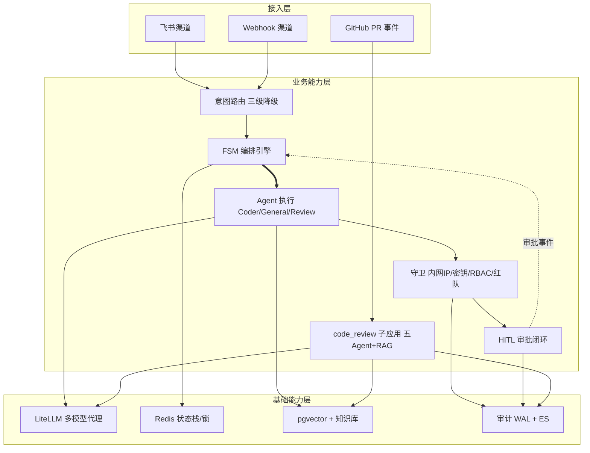
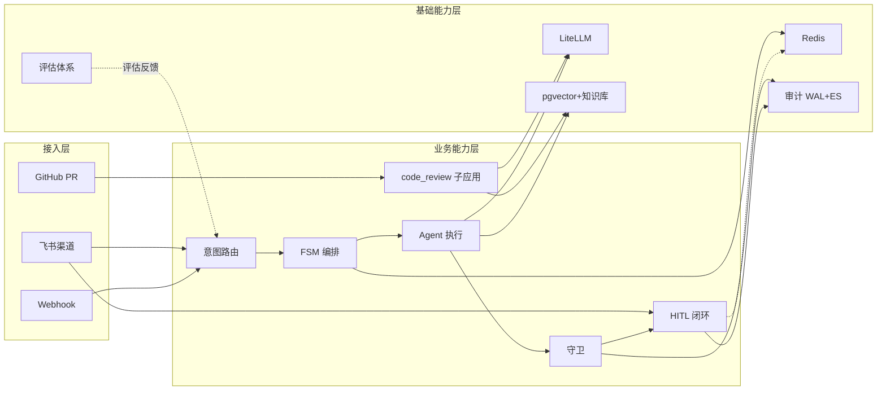

# AICoding 架构设计 · 高层架构设计

> ⚠️ **历史文档（2026-08，未按此实施）**：本文档是 AICoding 文档流水线的产物。注意其中的
> **D3「技术选型决策」写的是"评估选 RAGAS + DeepEval + Promptfoo"——那是推演，不是已落地的决定**；
> 这些框架在代码里**没有任何引用**，实际落地的是自研 harness（`evals/`）+ 审计 WAL + dashboard。
> 当前口径以 `定位与减法清单.md`、README 与 `docs/adr/` 为准。

> 本文档为《AICoding 架构设计》核心产物之一，对应**高层架构设计**模板。
> 上游输入：业务原始诉求（D2）+ 行业调研报告（research_report.md，G2 已通过）+ 资料摘要（material_digest.md，G1 已通过）；
> 下游输出：驱动《系统设计》《部署设计》《安全设计》《UserStory》四份文档（G4 起）的撰写。
> 本文档 Owner：business-architect（许边界）。本文档为 Phase 3（高层架构设计）唯一产出，冻结业务边界、输出高层架构、定义 MVP 与业务闭环。接口契约与模块拆分细节留待 G4 system-architect 处理，本文档仅在 §5.2 / §6.2 预留清晰接口边界与依赖声明。

---

## 0. 元信息：修订记录

```yaml
标题: moa-gateway - 高层架构设计 v0.1
版本: v0.1
状态: Reviewing   # Draft | Reviewing | Approved | Deprecated
创建日期: 2026-08-29
最后更新: 2026-08-29
作者: business-architect（许边界，业务架构师）
评审人:
  - team-lead（主理人 / 齐构成）
  - system-architect（下游系统设计 Owner，G4）

关联文档:
  上游输入:
    - 业务原始诉求 D2: 由主理人注入（企业级 Agent 网关，框架已搭、模块未跑通；复用现有代码、避免大规模重写）
    - 资料摘要: .workbuddy/output/material_digest.md（G1 已通过，根因 A~F 与冲突 X1~X3）
    - 行业调研报告: .workbuddy/output/research_report.md（G2 已通过，标杆加权矩阵与 MVP R1~R6 建议）
  下游产出:
    - 系统设计: AICoding架构设计-2-系统设计.md（G4）
    - 部署设计: AICoding架构设计-3-部署设计.md（G4）
    - 安全设计: AICoding架构设计-4-安全设计.md（G4）
    - UserStory: AICoding架构设计-5-UserStory.md（G4）
```

| 版本 | 日期 | 作者 | 变更内容 | 评审状态 |
| --- | --- | --- | --- | --- |
| v0.1 | 2026-08-29 | business-architect | 初稿：冻结业务边界、高层架构、MVP 裁决（R1~R6） | Reviewing（待 G3 审核） |

> **版本管理纪律**：破坏性变更（章节结构调整 / 关键决策反转）升 MAJOR；新增章节、扩充内容升 MINOR。

---

## 1. 需求概要

### 1.1 需求概要说明

**一句话定位**：moa-gateway 是企业级 Agent 网关，整体框架（FastAPI 入口、三级意图路由、FSM/HITL、飞书渠道、守卫、审计）已搭好，但各功能模块业务逻辑未跑通；本期定位为"框架已搭、模块未跑通"系统的修复与闭环补齐，目标是将现有骨架从"能启动"改造为"业务可运行"，且严格复用现有代码、避免大规模重写。

- **业务现状**：框架层（入口/路由/FSM/渠道/守卫/审计）已就绪，但数据层（检索/知识/HITL 交付）默认空或断裂，单测 monkeypatch 掩盖真实接线（根因 A~F 已实证）。
- **触发事件**：模块逻辑未打通，表现为 CoderAgent 永不选中、飞书 HITL 假闭环、RAG 形同虚设、存储 schema 割裂、脚本改写致接线漂移、CI 绿≠业务通。
- **系统定位一句话**：本系统是企业内部"统一 Agent 网关 / 编排入口"，承接飞书/Webhook/GitHub 流量，经意图路由→FSM 编排→Agent 执行→守卫→HITL→审计完成可信交付（见 §4.2、§5）。

### 1.2 关键决策摘要

| 编号 | 决策类别 | 决策内容 | 关联章节 |
| --- | --- | --- | --- |
| D1 | 范围决策 | 本期只做"修通断点 + 闭环补齐 + 评估反制"，不做多 Agent 复杂编排 runtime、不做 Dify/n8n/Rasa 平台级替换、不做大规模重写 | §4.2 / §6.1 |
| D2 | 复用 vs 新建 | 复用现有 FastAPI + LiteLLM + FSM 骨架与飞书/Redis/审计能力，仅吸收 semantic-router 与 LangGraph 的范式（路由键对齐、interrupt/resume），不引入其运行时 | §3.2 / §4.1 / §5.2 |
| D3 | 技术选型决策 | 意图路由键对齐用自研映射表（不引库，先止血）；向量库选 pgvector（与 Postgres 同库）；评估选 RAGAS + DeepEval + Promptfoo | §4.3 / §5.2 |
| D4 | MVP / 完整版边界 | MVP = R1 意图对齐 + R2 飞书 HITL 真闭环 + R3 轻量 RAG + R4 统一 PG + R5 评估 CI 门禁 + F6 接线回归；R6 多级 supervisor 延后完整版 | §4.3 |
| D5 | 部署形态 | 私有化企业内网、单租户，接入飞书/Webhook/GitHub；合规与数据不出域 | §4.2 / §5.2 |

**硬指标**：≥ 3 条，≤ 5 条；每条决策均映射到正文具体章节（D1→§6.1、D2→§3.2/§5.2、D3→§4.3、D4→§4.3、D5→§4.2）。

### 1.3 价值主张

| 价值维度 | 量化目标 | 度量指标 | 当前值 | 目标值 | 截止时间 |
| --- | --- | --- | --- | --- | --- |
| 效率 | 意图分发正确率提升至 100%（Coder/Review 意图可被正确分发） | Coder/Review 意图命中注册键比例 | 0%（CoderAgent 永不选中，见根因 A） | 100% | MVP 上线 |
| 合规 | 关键操作审计留痕覆盖率 100% | 审计 WAL 写入覆盖率 | 部分（WAL 存在但业务链路未全贯通） | 100% | MVP 上线 |
| 体验 | 飞书 HITL 审批结果真正回投率 100% | 审批后 agent_output 送达比例 | 0%（仅回执，见根因 B） | 100% | MVP 上线 |
| 成本 | 单次对话 LLM 调用单位成本可控（复用 LiteLLM fallback/cost） | 单位对话成本（LiteLLM 计量） | 基线 | ≤ 当前基线（不新增模型网关成本） | MVP 上线 |
| 技术 | 覆盖关键路径且非 monkeypatch 的真实集成测试比例 ≥ 80% | 真实接线集成测试占比 | 低（大量 monkeypatch 掩盖，见根因 F） | ≥ 80% | MVP 上线 |

**硬指标**：业务价值（效率/合规/体验）≥ 2 条 + 技术/成本价值（成本/技术）≥ 1 条；每条均量化，无"提升/优化/加强"等模糊词。

---

## 2. 需求分析 & 痛点解构

### 2.1 核心角色关注点

> 本章按**甲方决策者 / 最终用户 / 受影响方**三大维度盘点核心角色的关注点（甲方决策者、最终用户（含开发者）、受影响方（终端用户与合规）等核心角色的关注点如下）。

| 角色 | 业务身份 | 主要操作 | Top1 关心点 | 来源 |
| --- | --- | --- | --- | --- |
| 甲方决策者（CTO / 技术总监） | 业务负责人 | 看板审阅 / ROI 决策 / 上线审批 | 投入产出比明确、上线风险可控、避免大规模重写 | 用户诉求 D2 |
| 最终用户 A：内部开发者 | 一线使用者 | 经飞书 / Webhook 提交 Agent 请求 | 请求被正确路由到对应 Agent、结果可靠可复现 | 根因 A / B |
| 最终用户 B：运维 / SRE | 管理人员 | 监控 / 干预 / 排障 / 发布 | 系统可观测、故障可定位、HITL 可干预可恢复 | 根因 B / F |
| 受影响方：终端用户（被服务方） | C 端 / 业务方 | 经飞书触达网关获取答复 | 审批 / 答复及时送达（非仅"已批准"回执） | 根因 B |
| 受影响方：合规 / 安全 | 合规 / SRE | 审计 / 监控 / 越权拦截复核 | 关键操作 100% 留痕、越权与红队可控 | 守卫 / 审计模块 |

**硬指标**：≥ 3 类（甲方决策者 / 最终用户 / 受影响方各至少一行）；每行有"Top1 关心点"，无笼统"使用方便"。

### 2.2 核心痛点

> 将资料摘要根因 A~F 翻译为业务痛点 P1~P6。优先级标准：P1=直接影响业务核心流程或合规底线，不解决无法上线；P2=影响体验/效率，可 MVP 后迭代；P3=长尾/治理项。

| 编号 | 痛点描述 | 现象 / 数据 | 影响角色 | 影响程度 | 优先级 |
| --- | --- | --- | --- | --- | --- |
| P1（根因 A） | 意图标签与 Agent 注册键不匹配，CoderAgent 永不选中 | intent_router.py:27-37 返回 coding/translate/...；Agent 注册表仅 coder/general/review（agents/loader.py:4-11）；pipeline.py:172 `get_agent(intent) or get_agent("general")`；除 /review 外流量塌缩到 General，system prompt 从未生效 | 开发者、终端用户 | 高（路由核心失效） | P1 |
| P1（根因 B） | 飞书 HITL 假闭环，卡片 action 回调仅回执不闭环 | routes/feishu.py:69-96 仅 `adp.send()` 回执，无 engine.handle_event / remove_hitl / 投递 agent_output；真正闭环在 routes/webhook.py:16-65；用户点批准只回"已批准"，请求仍挂起 | 终端用户、合规 | 高（审批/合规底线） | P1 |
| P1（根因 F） | 单测 monkeypatch 掩盖真实接线，CI 绿≠业务通 | tests/unit/test_pipeline.py:148 将 get_agent 替换为 lambda 使 "coding" 也能命中绕过 A；test_ok_path 等"通过"但真实链路断裂 | 运维、甲方决策者 | 高（可运行性基线失真） | P1 |
| P2（根因 C） | 检索 / 知识 / RAG 默认全空，RAG 形同虚设 | deps.py:35 `_retriever=ContextRetriever(VectorDBClient())` 内存 dict 重启清空；knowledge.py 内存；obsidian 默认关；pipeline.py:179 retrieve() 永远返回空 | 开发者、终端用户 | 中（质量劣化） | P2 |
| P2（根因 D） | 两套并存 Schema 互不消费，数据层割裂 | storage/schema.sql 建 code_review_prs（PG+pgvector）；rag/vector_store.py:104-129 自建 SQLite code_review_vectors；review_store 从不读写 sqlite；PR 子应用 RAG dormant | 运维、开发者 | 中（数据孤岛） | P2 |
| P3（根因 E） | 9 个脚本用字符串 .replace() 直接改写源码，致接线漂移 | gen_main.py:4-27、patch_main.py、fix_main_all.py 等直接改写 app/main.py；是 A/B 断裂直接成因，属治理项 | 运维、开发者 | 中（维护债，CI 被 F 掩盖） | P3 |

**硬指标**：每条痛点有"现象 / 数据"佐证；P1 ≥ 1 条且 §2.3 有对应目标（P1 三条 A/B/F 均有 V1/V2/V3 对应）。

### 2.3 期待目标

| 编号 | 目标描述 | 对齐痛点 | 度量指标 | 当前值 | 目标值 | 截止时间 |
| --- | --- | --- | --- | --- | --- | --- |
| V1 | 意图→Agent 注册键对齐率 100%，Coder/Review 可被正确分发 | P1（A） | 正确分发率 | 0% | 100% | MVP 上线 |
| V2 | 飞书 HITL 审批真闭环率 100%，结果回投 | P1（B） | 闭环率 | 0% | 100% | MVP 上线 |
| V3 | 集成测试真实接线比例 ≥ 80%，去除掩盖性 monkeypatch | P1（F） | 真实集成测试占比 | 低 | ≥ 80% | MVP 上线 |
| V4 | 检索召回可用（真向量 RAG 轻量版上线，向量 + 关键词混合） | P2（C） | 召回命中率 | 0% | ≥ 基线（混合检索） | MVP（轻量）/ 完整版增强 |
| V5 | 存储统一为单一 PG 实例，合并 code_review_prs 与 code_review_vectors 两套 schema | P2（D） | schema 割裂数 | 2 套 | 1 套 | MVP（随 R4） |
| V6 | 字符串改写源码脚本清零（gen_main 等停用，接线回归正确） | P3（E） | 字符串改源码脚本数 | 9 | 0 | MVP |

**硬指标**：每条目标有数字 + 对齐 ≥1 条痛点；P1 痛点（A/B/F）均有对应 V 级目标（V1/V2/V3）。

### 2.4 基线复用

> 先盘点现有可复用能力，再决定新建；凡列入"功能缺口"的能力，均确认基线无法覆盖。

| 复用类别 | 现有能力 | 复用方式 | 来源系统 | 备注 |
| --- | --- | --- | --- | --- |
| 网关骨架 | FastAPI 入口 / main.py、三级意图路由、FSM 引擎、守卫、审计 WAL | 直接复用 + 修正接线 | moa-gateway（app/） | 框架已搭，仅补逻辑 |
| 多模型代理 | LiteLLM（多 provider / fallback / cost 计量） | 直接复用 | app/deps.py | 不重写，符合复用约束 |
| 渠道接入 | 飞书自研收发 / 验签 / 卡片 | 复用 + 修正回调端点 | app/channels/feishu*.py | 修复根因 B |
| 状态 / 锁 | Redis 状态栈 / Lua 锁 | 直接复用 | app/redis_state/ | HITL 挂起态存储 |
| 评估基座 | evaluator / redteam / LLM-as-judge 数据集 | 复用 + 接 CI 门禁 | app/evaluator/、evals/ | 反制根因 F |
| 子应用 | code_review_pipeline（triage/static/semantic/test/report 五 Agent + RAG） | 复用 + schema 合并 | apps/ | 数据源，非新建 |

**硬指标**：必须先盘点再决定新建；功能缺口（§2.5）均确认基线无法覆盖。

### 2.5 功能缺口

> 在现有基线之上仍需新建 / 修正的能力，按业务阶段维度分组（接入/路由 → 执行/守卫 → 检索/知识 → HITL/交付 → 存储/数据 → 运营/评估），每条对齐 §2.3 目标且 MVP 缺口在 §6.3 有 MVP 标记。

| 阶段 | 功能缺口 | 必要性 | 优先级 | 对齐目标 |
| --- | --- | --- | --- | --- |
| 接入 / 路由 | F1 意图↔Agent 注册键对齐映射（自研映射表，不引库） | 必须 | MVP | V1 |
| HITL / 交付 | F2 飞书 HITL 真闭环（回调指向 /webhook/callback，状态翻转 + 结果回投） | 必须 | MVP | V2 |
| 检索 / 知识 | F3 真向量 RAG 轻量版（pgvector + 混合检索，离线关键词回退） | 重要 | MVP（轻量） | V4 |
| 存储 / 数据 | F4 统一 Postgres + pgvector，合并两套 schema | 必须 | MVP | V5 |
| 运营 / 评估 | F5 评估体系 + CI 门禁（RAGAS/DeepEval/Promptfoo，去 monkeypatch） | 必须 | MVP | V3 |
| 治理 | F6 停用字符串改写脚本，接线回归正确骨架 | 必须 | MVP | V6 |
| 接口规范 | F7 接口契约与调用设计（冻结下游 G4 边界） | 必须 | MVP | V1 / V2 |
| 协作增强 | R6 多级 supervisor 复杂协作 | 延后 | 完整版 | — |

**硬指标**：每条缺口对齐 §2.3 至少一条目标；MVP 缺口（F1~F7）在 §6.3 功能清单中对应 MVP 范围标记。

---

## 3. 行业调研

> 本章嵌入 `research_report.md`（G2 已通过）的标杆表、加权矩阵与分层结论。完整报告见 §3.3 归档路径。

### 3.1 行业标杆系统分析

| 标杆系统 | 厂商 / 社区 | 场景覆盖 | 技术亮点 | 商业模式 | 适用度 |
| --- | --- | --- | --- | --- | --- |
| Dify | LangGenius（开源 + Dify Cloud SaaS） | LLM 应用 / Agent / Workflow / RAG / 知识库 | 可视化工作流、Agent 运行时、Human Input 节点（多分支 + 超时升级 + 评论回投）、混合检索 | 开源 + 云订阅 | 中（头部 SaaS 代表） |
| LangGraph | LangChain（开源 + LangSmith SaaS） | 多 Agent 编排 / 状态机 / HITL | Supervisor 多 Agent、interrupt()/Command(resume)、checkpointer 持久化 | 开源（BSD）+ 用量计费 | 高（库级可嵌入） |
| n8n | n8n GmbH（开源 + n8n Cloud） | 工作流自动化 / AI Agent / HITL | Wait 节点（On Webhook Call）、Human review、10+ 审批通道 | 开源 + 云/企业订阅 | 中 |
| Rasa | Rasa（开源 + 企业版） | 对话式 AI / 意图识别 | NLU pipeline、Stories/Policies、intent 名=action 名契约 | 开源（Apache 2.0）+ 企业订阅 | 低（场景错配） |
| semantic-router | Aurelio AI（开源） | 意图路由 / Agent 分发决策层 | RouteLayer，0 LLM 调用、毫秒级；Route.name 即下游键；HybridRouteLayer | 开源（MIT） | 高（库级可嵌入） |

**硬指标**：≥ 3 家；含 ≥1 头部 SaaS（Dify Cloud）+ ≥1 开源/自研代表（LangGraph / Rasa / semantic-router 均为开源）。

### 3.2 方案对标及优先级打分

> 权重针对"代码优先、需复用、体量中等、企业内网"特征设定，每行权重之和 = 1.00。

| 评估维度 | 权重 | Dify | LangGraph | n8n | Rasa | semantic-router |
| --- | --- | --- | --- | --- | --- | --- |
| 场景契合度 | 0.30 | 4 | 4 | 3 | 2 | 4 |
| 技术成熟度 | 0.20 | 5 | 5 | 5 | 5 | 3 |
| 集成难度（反向） | 0.15 | 2 | 3 | 3 | 2 | 5 |
| 成本（反向） | 0.15 | 3 | 4 | 3 | 3 | 5 |
| 合规可控性 | 0.20 | 4 | 5 | 4 | 5 | 5 |
| **加权总分** | **1.00** | **3.75** | **4.25** | **3.60** | **3.35** | **4.30** |

**结论摘要**（依据 research_report §3.2）：
- **优先借鉴**：`semantic-router`（4.30）与 `LangGraph`（4.25）——均为库级、可嵌入，契合"复用不重写"。semantic-router 的 `Route.name` 直接作为 Agent 分发键，消除根因 A；LangGraph supervisor handoff 与 `interrupt()/Command(resume)` 分别是"意图→Agent 分发"与"HITL 状态翻转"的可参照范式。
- **部分借鉴**：`Dify`（3.75）与 `n8n`（3.60）——借鉴 Dify 的 Human Input 多分支 + 超时升级 + 评论回投、混合检索（向量+全文+重排）；借鉴 n8n 的 Wait-on-webhook + 超时升级 + 审计日志 HITL 模式。不借鉴其平台整体替换。
- **不借鉴（否决）**：`Rasa`（3.35）整体框架（面向对话机器人、需训练 NLU、场景错配、过重），以及任何"以 Dify/LangGraph/n8n 整体替换自研骨架"的方案（违背用户冻结的"复用现有代码、避免大规模重写"约束）。

### 3.3 完整报告参考

- 完整报告路径：`D:\HermesData\moa-gateway\.workbuddy\output\research_report.md`（亦可用相对路径 `.workbuddy/output/research_report.md`）
- 调研工具：`tech-research-advisor`
- 调研日期：2026-08-29
- 调研归档：`.workbuddy/output/research_report.md`（G2 已通过）

---

## 4. 方案决策

### 4.1 价值定位澄清

**定位三段式**：

```
对外价值（客户侧）: 让企业内部开发者 / 业务方经飞书等渠道获得"请求被正确理解并可靠执行、审批可闭环"的 Agent 服务，缩短从提问到可信答复的时延。
对内价值（运营侧）: 复用既有 FastAPI + LiteLLM 骨架实现零重写成本；一线提效（正确路由）+ 管理可控（HITL 真闭环 + 审计 100%）+ 合规留痕。
差异化价值        : 相对 Dify / n8n 等平台整体引入，本方案在自研骨架上吸收语义路由 + interrupt/resume 范式，以"零运行时平台替换"实现同等闭环能力，运维与合规边界可控、数据不出域。
```

**与产品矩阵的关系**：本系统在企业 AI 能力矩阵中承担"统一 Agent 网关 / 编排入口"，上游接飞书 / Webhook / GitHub，下游消费 LiteLLM / Redis / PG / 审计，经意图路由→FSM 编排→Agent 执行→守卫→HITL→审计形成完整业务闭环（见 §5.2、§5.3）。

### 4.2 系统定位澄清

| 维度 | 内容 |
| --- | --- |
| 系统名称 | moa-gateway（企业级 Agent 网关） |
| 系统类型 | 已有系统扩展 / 改造（框架已搭，补齐业务逻辑，非新建） |
| 部署形态 | 私有化（企业内网） |
| 多租户 | 否（单租户企业内网，N2 非功能约束） |
| 服务对象 | 内部开发者 / 运维 / 合规（对齐 §2.1 角色） |
| 上游依赖 | 飞书开放平台、GitHub（PR 事件）、LiteLLM 上游模型 provider（详见 §5.2） |
| 下游消费者 | 业务系统 / 终端用户（经飞书触达）、审计与监控平台 |
| 边界（不做） | 不做多 Agent 复杂编排 runtime（R6 延后完整版）；不做 Dify/n8n/Rasa 平台级替换；不做跨云多租户；不做大规模重写（仅吸收范式 + 修正接线） |

### 4.3 MVP 与完整版决策

> 对齐 research_report §4.2 的 R1~R6，由业务架构师落地为决策（含环境不确定性的内建回退，不做静默选择）。

Out-of-Scope（延后项 R6 见下表"不做（延后）"列）：
| 阶段 | 时间窗 | 范围（功能编号） | 架构差异点 | 退出标准 | 不做（延后） |
| --- | --- | --- | --- | --- | --- |
| MVP | 改造第 1~N 迭代（G4 起排期） | F1, F2, F3（轻量）, F4, F5, F6, F7 | 单 PG 实例（或 SQLite 回退）、飞书真闭环端点 /webhook/callback、自研映射表修 A、评估接 CI 门禁 | 跑通主链路（意图→Agent→守卫→HITL 真闭环→审计）+ 集成测试真实化 ≥ 80% | R6 多级 supervisor、Qdrant 重排、多知识库 |
| 完整版 | 后续迭代 | + R6 多级 supervisor、重排 / 多知识库、强化评估 | 双 Agent supervisor、可选 Qdrant（>500 万向量再评估）、评估数据集持续扩充 | 复杂协作场景稳定 30 天 + 评估门禁全绿 | — |

**环境不确定性的内建回退（冻结边界，非待确认）**：
- U-01 内网是否允许外联 embedding：MVP RAG 默认外部 embedding API；若禁外联，回退本地 FastEmbed / bge 系列 + 关键词检索兜底（Coder/Review 场景仍可用）。
- U-02 是否已有可用的 Postgres 实例？MVP 复用统一 Postgres + pgvector；若无，以 Docker 单容器 PG 或 SQLite 回退，存储层架构（单一实例承载关系+向量）保持一致，迁移脚本后补。
- U-03 飞书卡片回调 URL 配置权限：飞书卡片 action 回调**必须**指向 /webhook/callback（业务边界不变）；若配置权限受限，降级为飞书机器人私聊回执 + 人工轮询，但闭环端点仍为 /webhook/callback，权限问题列为部署风险（见 §5.2）而非设计分歧。

**演进纪律**：✅ MVP 架构骨架是完整版的子集（R3 轻量 RAG 可平滑升级重排/多知识库，不推倒重来）；✅ MVP 中可 Mock 的能力（外部 embedding、PG 实例）已在上明确"完整版替换/回退计划"；❌ 禁止为赶工引入完整版无法继承的临时架构。

---

## 5. 业务架构设计

### 5.1 业务架构图

> 本业务架构分为三层：**接入层**（飞书 / Webhook / GitHub）负责流量入口与渠道适配；**业务能力层**（意图路由 / FSM 编排 / Agent 执行 / 守卫 / HITL / code_review 子应用）负责核心业务编排与处置；**基础能力层**（LiteLLM / Redis / pgvector + 知识库 / 审计）提供模型、状态、存储与合规底座。实线 = 同步调用，虚线 = 异步事件，粗线 = 主链路。



### 5.2 系统依赖架构

| 依赖类型 | 系统 / 模块 | 提供方 | 依赖能力 | 接入方式 | 同步/异步 | 关键约束 |
| --- | --- | --- | --- | --- | --- | --- |
| 上游 | 飞书开放平台 | 飞书 | 消息收发 / 卡片 action 回调 | HTTPS Webhook（验签） | 异步（事件回调） | 卡片 action 回调**必须**指向 /webhook/callback（修复根因 B，防 R-02 重现）；配置权限见 U-03 |
| 上游 | GitHub | GitHub | PR 事件 / 代码获取 | HTTPS Webhook / REST | 异步（事件）+ 同步（API 拉取） | GITHUB_TOKEN 权限；RAG 需手动摄入向量 |
| 上游 | 模型 Provider | LiteLLM 上游 | 多模型推理 / fallback / cost | HTTPS（LiteLLM 代理） | 同步（含超时） | 复用现有 LiteLLM；缺 key 时优雅降级（不阻断启动） |
| 下游 | LiteLLM | 自研集成 | 统一模型调用 | Python SDK（进程内） | 同步 | 多 provider 故障转移；cost 计量 |
| 复用底座 | Redis | 自研集成 | HITL 挂起态 / 状态栈 / Lua 锁 | Redis 协议 | 同步 | 无 REDIS_URL 时内存回退（不丢主链路）；飞书凭证缺失时 REVIEW 只挂起不发卡 |
| 复用底座 | Postgres + pgvector | 自研集成 | 关系数据 + 向量（合并两套 schema） | psycopg（裸 SQL）/ SQL | 同步 | 单一 PG 实例承载 code_review_prs + code_review_vectors（修复 D/X1）；SQLite 仅本地回退 |
| 复用底座 | 审计 WAL + ES | 自研集成 | 关键操作留痕 | 文件 WAL + 可选 ES 双写 | 异步（写 WAL） | 审计覆盖率 100%（N2）；ES 可选 |
| 复用底座 | 评估框架 RAGAS/DeepEval/Promptfoo | 采购/引入 | 意图准确率 / faithfulness / 红队 | CI 调用（进程内 + CLI） | 同步（CI 门禁） | 去除 monkeypatch（反制 F）；Golden Dataset ≥ 50 例 |

**硬指标**：每条依赖明确"接入方式 + 同步/异步 + 关键约束"；所有 P1 痛点（A/B/F）对应核心能力均在本表有依赖来源（A→意图路由自研映射、B→飞书回调端点、F→评估框架 CI 门禁）。

### 5.3 业务闭环

**业务主链路**（端到端）：
```
触发（飞书/Webhook/GitHub）→ 识别（意图路由→Agent 注册键对齐）→ 处置（FSM 编排→Agent 执行→守卫评估）→ 交付（HITL 真闭环→渠道回投 agent_output）→ 复盘（评估+审计）→ 反馈回路
```

**关键反馈回路**：

| 回路 | 触发点 | 反馈对象 | 反馈机制 | 价值 |
| --- | --- | --- | --- | --- |
| 业务效果回路 | 评估打分（evaluator / LLM-as-judge） | 意图路由 / Prompt 注册表 | 离线统计 + 提示优化 | 提升路由准确率与答复质量（对齐 V1/V3） |
| 运营监控回路 | 审计异常 / HITL 挂起超时 | 运维 / SRE | 实时告警 + 手动干预 | 快速响应（对齐 N2 审计 100%） |
| 模型迭代回路 | 人工标注 / Golden Dataset | 评估体系 / RAG 检索 | 周度 eval + 重排调优 | 提升 RAG 召回（对齐 V4） |

**运营主线**：每日由运维看板核对 HITL 挂起与审计覆盖率；每周由甲方决策者审阅路由命中率与评估门禁趋势；每月由合规复核审计留痕完整性，作为上线/扩容决策依据（呼应 §6.5 管理端原型）。

---

## 6. 产品需求及原型

### 6.1 需求边界

**In-Scope**（本期必做，功能编号对齐 §2.5 与 §4.3）：

```
F1. 修复意图↔Agent 注册键对齐（自研映射表，不引库）
F2. 飞书 HITL 审批真闭环（回调指向 /webhook/callback，状态翻转 + 结果回投）
F3. 真向量 RAG 轻量版（pgvector + 向量/关键词混合，离线回退）
F4. 统一 Postgres + pgvector，合并 code_review_prs 与 code_review_vectors 两套 schema
F5. 评估体系 + CI 门禁（RAGAS/DeepEval/Promptfoo，去除 monkeypatch）
F6. 停用字符串改写源码脚本（gen_main 等），接线回归正确骨架
F7. 接口规范与调用设计（冻结下游 G4 边界，预留依赖声明）
N1. 单租户企业内网部署
N2. 审计留痕覆盖率 100%
N3. 集成测试真实接线比例 ≥ 80%
N4. 复用现有代码，避免大规模重写（仅吸收范式 + 修正接线）
N5. 飞书 HITL 审批真闭环率 100%
```

**Out-of-Scope**（本期不做，必须列原因）：
| 编号 | 不做的事 | 原因 | 后续计划 |
| --- | --- | --- | --- |
| O1 | 多 Agent 复杂编排 runtime（supervisor 多级） | MVP 先跑通分发与闭环，多级协作为增强项；避免范围蔓延（D1） | 完整版（R6） |
| O2 | Dify / n8n / Rasa 平台级替换 | 违背用户冻结的"复用现有代码、避免大规模重写"约束 | 不做（否决） |
| O3 | 大规模重写（推倒自研骨架） | 框架已搭、仅业务逻辑未通；重写风险高、返工大 | 不做（仅修正接线 + 吸收范式） |
| O4 | 跨云多租户 | 本期定位企业内网单租户（N1） | 后续版本按需评估 |

> Out-of-Scope 的冻结结论将作为下游系统设计（G4）的硬约束；任何超出本边界的诉求须回到 G3 重新裁决。

**硬指标**：In-Scope ≤ 15 条（本期限定 12 条：F1~F7 + N1~N5）；Out-of-Scope ≥ 3 条（O1~O4，含原因与后续计划）。

### 6.2 产品模块全景图

> 重绘真实业务模块（非示例）。每个模块标注一级归属、上下游与 MVP 包含性。

Out-of-Scope 模块（本期不做）不纳入以下全景：
| 模块名称 | 一级归属 | 责任团队 | 上游 | 下游 | MVP 是否包含 |
| --- | --- | --- | --- | --- | --- |
| 飞书渠道接入 | 接入层 | 网关研发 | 飞书开放平台 | 意图路由 | 是 |
| Webhook 接入 | 接入层 | 网关研发 | 外部系统 / GitHub | 意图路由 / code_review | 是 |
| 意图路由（三级降级 + 键对齐） | 业务能力层 | 网关研发 | 接入层 | FSM 编排 | 是（F1） |
| FSM 编排引擎 | 业务能力层 | 网关研发 | 意图路由 | Agent 执行 | 是 |
| Agent 执行（Coder/General/Review） | 业务能力层 | 网关研发 | FSM | 守卫 / 检索 | 是 |
| 守卫（IP/密钥/RBAC/红队） | 业务能力层 | 安全研发 | Agent 执行 | HITL / 交付 | 是 |
| HITL 审批闭环 | 业务能力层 | 网关研发 | 守卫 | 渠道回投 / 审计 | 是（F2） |
| code_review 子应用 | 业务能力层 | 子应用研发 | GitHub Webhook | LiteLLM / PG | 是（随 R4 合并 schema） |
| LiteLLM 多模型代理 | 基础能力层 | 平台研发 | 模型 Provider | Agent 执行 | 是（复用） |
| Redis 状态栈 / 锁 | 基础能力层 | 平台研发 | — | HITL / FSM | 是（复用） |
| pgvector + 知识库 | 基础能力层 | 平台研发 | 检索 / code_review | Agent / RAG | 是（F3/F4） |
| 审计 WAL + ES | 基础能力层 | 安全研发 | 全链路 | 监控平台 | 是（N2） |
| 评估体系（RAGAS/DeepEval/Promptfoo） | 基础能力层（运营） | 质量研发 | CI | 路由 / Prompt 优化 | 是（F5） |



### 6.3 功能清单

> 五列功能清单（编号 / 一级模块 / 二级功能 / 功能描述 / 优先级 / MVP 范围 / 完整版范围 / 对齐目标）。**硬指标：每个 P0 功能必须在 MVP 范围内为 ✅**；每个功能反向映射到 §2.5 功能缺口 + §2.3 期待目标。

| 编号 | 一级模块 | 二级功能 | 功能描述 | 优先级 | MVP 范围 | 完整版范围 | 对齐目标 |
| --- | --- | --- | --- | --- | --- | --- | --- |
| F1 | 意图路由 | 注册键对齐 | 建立意图标签→Agent 注册键同构映射表，消除键不匹配，Coder/Review 可命中 | P0 | ✅ | ✅ | V1 |
| F2 | HITL | 飞书真闭环 | 卡片 action 回调指向 /webhook/callback，engine.handle_event 翻转状态并回投 agent_output | P0 | ✅ | ✅ | V2 |
| F3 | 检索/知识 | 轻量 RAG | pgvector + 向量/关键词混合检索，离线关键词回退 | P1 | ✅（轻量） | ✅（重排/多库） | V4 |
| F4 | 存储 | 统一 PG | 单一 PG+pgvector 承载关系+向量，合并两套 schema，SQLite 回退 | P0 | ✅ | ✅ | V5 |
| F5 | 评估 | CI 门禁 | RAGAS/DeepEval/Promptfoo 接 CI，去 monkeypatch 真实集成测试 | P0 | ✅ | ✅ | V3 |
| F6 | 治理 | 接线回归 | 停用 gen_main 等字符串改写脚本，接线回归正确骨架 | P0 | ✅ | ✅ | V6 |
| F7 | 接口规范 | 调用设计 | 冻结下游 G4 接口边界与依赖声明（路由/FSM/Agent/渠道契约） | P0 | ✅ | ✅ | V1/V2 |
| N1 | 部署 | 单租户内网 | 私有化企业内网、单租户隔离 | P0 | ✅ | ✅ | — |
| N2 | 合规 | 审计留痕 | 关键操作 100% 写入审计 WAL | P0 | ✅ | ✅ | — |
| N3 | 质量 | 测试真实化 | 真实接线集成测试占比 ≥ 80% | P0 | ✅ | ✅ | V3 |
| N4 | 约束 | 复用不重写 | 仅吸收范式 + 修正接线，不引入运行时平台 | P0 | ✅ | ✅ | — |
| N5 | 体验 | HITL 闭环率 | 飞书审批结果回投率 100% | P0 | ✅ | ✅ | V2 |
| R6 | 协作 | 多级 supervisor | 多 Agent 复杂编排（handoff / supervisor） | P2 | ❌ | ✅ | — |

**硬指标自检**：每个 P0 功能（F1~F7、N1~N5）MVP 范围均为 ✅；每个功能均映射到 §2.5 缺口与 §2.3 目标。

### 6.4 产品原型 - 飞书交互端（开发者 / 终端用户触点）

**核心页面清单**：

| 页面 | 用途 | 关键交互 | MVP |
| --- | --- | --- | --- |
| 对话 / 请求页 | 提交 Agent 请求，查看分发结果与答复 | 指令输入 / 查看 Agent 类型与执行结果 | ✅ |
| 审批卡片 | HITL 人工审批（批准/拒绝/评论） | 点击 action → 真实闭环回投结果 | ✅ |
| 审批结果回执 | 展示 agent_output 真正送达 | 结果呈现 / 可追问 | ✅ |
| 知识检索浮层 | 查看 RAG 召回来源（轻量版） | 溯源引用 | ❌（完整版增强） |

**关键交互约束**：
- 审批闭环响应：用户点批准到结果回投 P99 ≤ 5 秒（对齐 N5/V2，需飞书回调指向正确端点）。
- HITL 挂起超时：默认 24 小时未审批触发升级/超时处理（借鉴 Dify/n8n 超时升级模式）。

**原型链接**：本期以飞书消息卡片 + 回执为交互载体，无独立前端 Figma（企业内网场景）。

### 6.5 产品原型 - 运营管理 / 审计端（运维 / 甲方决策者触点）

**核心页面清单**：

| 页面 | 用途 | 关键交互 | MVP |
| --- | --- | --- | --- |
| 运行看板 | 路由命中率 / HITL 挂起 / 审计覆盖率总览 | 实时刷新 / 下钻 | ✅ |
| 审计详情 | 单条操作全貌（含 HITL 翻转记录） | 回放 / 时间轴 | ✅ |
| 评估门禁面板 | CI 评估趋势（意图准确率 / faithfulness / 红队） | 趋势下钻 / 失败归因 | ✅ |
| 趋势归因页 | 多维归因分析 | 多维下钻 | ❌（完整版） |
| 监控/预警面板 | HITL 超时 / 异常告警 | 实时刷新 / 一键干预 | ✅ |

**关键交互约束**：
- 审计覆盖率指标实时展示，目标 100%（N2）；低于阈值触发告警。
- 评估门禁面板与 CI 联动，门禁失败阻断合入（反制根因 F）。

**原型链接**：本期以内部看板 / 审计查询页为运营载体。

---

## 附录 A：生成流程方法论

> 本附录为高层架构设计的生成方法论（元信息，不按业务替换）。

### A.0 生成流程总览

| 步骤 | 名称 | 核心产出 | 落入正文章节 |
| --- | --- | --- | --- |
| Step0 | 业务基础知识库构建 | 关联文档结构化知识库 | （为全文提供输入） |
| Step1 | 行业调研分析 | 行业标杆 / 方案对比 / MVP 决策 | §3 行业调研 |
| Step2 | 需求分析 / 痛点解构 | 需求画像卡 | §2 需求分析 & 痛点解构 |
| Step3 | 能力盘点，系统定位 | 价值定位 + 系统定位 | §4 方案决策 / §5.2 系统依赖架构 |
| Step4 | 生成系统高层架构设计 | 本文档主文档 | §1 ~ §5 |
| Step5 | 产品需求及原型 | 需求边界 + 全景图 + 原型 | §6 产品需求及原型 |

### A.1 ~ A.6 步骤说明（要点）

- **Step0**：读取 material_digest.md（G1）、research_report.md（G2）、用户诉求 D2，构建关联知识库。
- **Step1**：嵌入 research_report 的标杆表、加权矩阵（权重和=1.00）与三层结论，落成 §3。
- **Step2**：将根因 A~F 翻译为痛点 P1~P6，角色分三类，目标 V1~V6 量化对齐（§2）。
- **Step3**：能力盘点（§2.4 基线复用）+ 价值/系统定位（§4.1/§4.2）+ 依赖架构（§5.2）。
- **Step4**：整合为 §1~§5 高层架构。
- **Step5**：输出需求边界、模块全景、功能清单、原型（§6）。

---

## 附录 B：配套工具清单

### B.1 知识库 Skill

- `docx` / `pdf` / `pptx` / `xlsx`（解析存量文档，本阶段上游已结构化）

### B.2 行业调研

- `tech-research-advisor`（产出 research_report.md，G2 已通过）

### B.3 校验工具

- `validate_template_compliance.py`（本阶段产出硬指标自动校验）

---

## 附录 C：中间确认协议自检（business-architect 适用）

> 依据中间确认协议 §2.1（方案分歧判定）+ §2.3（反向验证 3 问），在产出 §1~§6 关键章节后做自检，结果留存供主理人 G3 追溯。

### C.1 §2.1 方案分歧判定（触发标准 #1）

判定标准：是否出现"≥2 方案均合理、影响下游、且用户/上游未冻结"的决策点？

- **候选分歧 1：向量库 pgvector vs Qdrant**。research_report §4.3 已给出明确推荐（pgvector 优先，Qdrant 为 >500 万向量时的备选），属有结论的资源选型，非未冻结平局；业务架构师据此**冻结为 pgvector（与 PG 同库）**，Qdrant 仅作完整版阈值触发项，不发起。
- **候选分歧 2：是否引入 semantic-router 库 vs 仅自研映射表修 A**。research_report §4.3 推荐"自研对齐映射 + 参考 semantic-router 范式（不引库）"，已收敛；业务架构师**冻结为自研映射表（MVP 先止血）**，semantic-router 仅作范式参考，不发起。
- **候选分歧 3：embedding 外联 vs 本地（U-01）/ PG 实例有无（U-02）/ 飞书回调权限（U-03）**。均属环境事实类不确定，非设计分歧；业务架构师已在 §4.3 内建回退链（外部 API→本地 FastEmbed/关键词；PG→Docker 单容器/SQLite；回调权限受限→私聊回执但闭环端点不变）冻结边界，不作静默选择，亦不发起。
- **已冻结顶层约束**：用户诉求"尽量复用现有代码、避免大规模重写"已排除"Dify/n8n/Rasa 平台替换"类方案（research_report §3.2 已否决）。

**结论：本阶段未命中 §2.1 触发标准**（无 ≥2 均合理且用户/上游未冻结的分歧）。

### C.2 §2.3 反向验证 3 问（强制）

| 问题 | 答案与证据 |
| --- | --- |
| Q1：这个决策若 3 个月后被推翻，工程返工成本可控吗？ | 本文档产出为**高层架构决策**（边界/MVP 裁决），非代码改动；即便下游推翻某选型（如 pgvector→Qdrant），返工限于存储层迁移脚本与检索适配，属系统架构师 G4 的局部改动，**不涉及本阶段产物 30% 以上返工**。切换成本 = 数人日，非月级。 |
| Q2：这个决策的结果，用户 / 客户 / 监管能感知到吗？ | 能。F1 使 Coder/Review 请求被正确分发（开发者可感知）；F2 使飞书审批结果真正回投（终端用户/合规可感知）；N2 审计 100% 留痕（监管/合规可感知）。这些是用户可见行为变化，已由本文档明确冻结。 |
| Q3：这个决策与用户原始诉求中显式提及的能力是否一致？ | 一致。用户原文（D2）要求"尽量复用现有代码、避免大规模重写"；本文档 D1/D2/N4 明确不做平台替换、仅吸收范式+修正接线，并直接引用该约束作为 O2/O3 否决依据。 |

Q1、Q2、Q3 均未命中 §2.2 任一情形 → **无需发起 [中间确认]**。

### C.3 结论

本阶段（business-architect / Phase 3 高层架构设计）**全程未命中**中间确认协议的触发标准，故未向主理人发起 `[中间确认]` 阻塞消息。所有"取舍"已作为**冻结决策**落在 §1.2（D1~D5）、§4.3（MVP/R1~R6 + 环境回退）、§6.1（In-Scope/Out-of-Scope）中，供 G3 审核与 G4 下游消费。
