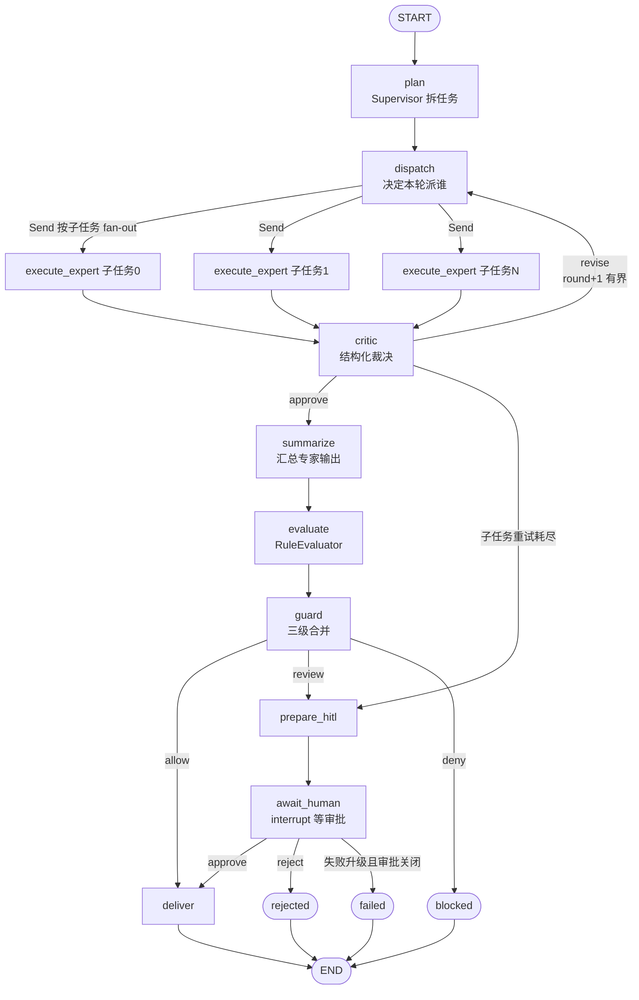

# 多 Agent 协作链路（ADR-022 / R6）

> 状态：已实现，**默认关闭**（`COLLAB_ENABLED=false`）。开启也不改变任何既有路径的行为。
> 决策记录：[adr-022](adr/adr-022-multi-agent-collaboration.md)。

## 它是什么

R6（多级 supervisor）从立项起一直被冻结。ADR-022 把它解冻，形态收敛成一件事：

**Supervisor 拆任务 → 按子任务 handoff 给专家并发执行 → Critic 反思 → 有界重跑 → 汇总过同一条守卫链。**

专家不是新写的 Agent，就是 `AGENT_REGISTRY` 里已有的 `coder` / `general` / `review`。
协作链路提供的是 FSM 管道**没有的能力**：分工与反思。治理原语则一条没新写——
`execute_with_retry`、`RuleEvaluator`、`_merge_guard`、`_verdict_from_eval_issues`、
`_tool_failure_issues`、guard 三级合并、审计 WAL，全部是请求路径那几份。

差异化不在"我们有多 Agent"，而在**多 Agent 仍然在治理之下**：每个专家的输出要过
评估器，整份协作结果要过 guard 三级合并，命中 REVIEW 就进人工审批，Critic 打回
只重跑被打回的子任务，轮次耗尽也不把没通过的输出说成成功。

## 图结构



三个值得单独说的点：

* **handoff 是 `Send`，不是节点里的函数调用。** `dispatch` 只决定派谁，具体派发由
   条件边返回 `[Send("execute_expert", {...}) for st in pending]` 完成。多个
   `execute_expert` 在同一 superstep 并发执行，各自的写入靠 reducer 合并
   （`outputs` 按子任务序号覆盖、成本与工具计数累加、`node_path` 追加）。
   `Send` 的第二个参数是该节点的**完整输入**，所以 trace/session/round 必须一起带过去。
* **反思回边是有界的。** `COLLAB_MAX_ROUNDS`（默认 2）限制执行轮数，
   `COLLAB_MAX_SUBTASKS`（默认 4）限制子任务数。到上限仍不通过时
   `critique_unresolved=True`：照常交付，但文本前置「critic 未通过」标注，
   并把 `need_human_review` 置真——HITL 开着则直接转人工。
* **HITL 拆成两个节点。** `interrupt()` 被中断的节点在 resume 时会从第一行重放，
   所以"记下挂起原因"（`prepare_hitl`）和"等人"（`await_human`）必须分开，
   否则每次 resume 都会重写一遍，`pending_review` 也永远落不进 checkpoint。

## 与 ADR-008 对照适配器的区别

这是两件不同的事，容易混：

| | `app/orchestration/graph.py`（ADR-008） | `app/orchestration/collaboration.py`（ADR-022） |
| --- | --- | --- |
| 目的 | 证明图运行时与 FSM 管道**等价** | 提供 FSM 管道**没有的能力** |
| 路径 | 单 Agent 请求路径的第二种写法 | 一条新路径 |
| 状态 | 与 `MoAPipeline` 逐字段对齐 | 自己的 `CollabState` |
| FSM | 驱动，且状态只能经 `next_state()` 得出 | **不驱动**（见下） |
| 门禁 | `test_langgraph_adapter.py` 钉住协作者表面 | 无请求路径门禁，因为它不在请求路径上 |

两者共用同一批治理原语，所以"协作绕过守卫"在结构上不可能发生——守卫只有一份定义。

## 为什么协作不驱动会话 FSM

不是懒，是两个具体原因：

1. `prepare_hitl` 若向一个从未 `MESSAGE_RECEIVED` 过的会话发 `NEEDS_HUMAN`，
   `INIT + NEEDS_HUMAN` 是迁移表里没有的一跳，直接 `InvalidStateTransitionException`。
2. 若协作与请求路径共用 `session_id`，两个写者会去抢同一个会话状态——这正是
   `Engine.handle_event` 里 per-session 锁存在的理由。

所以协作的挂起活在 LangGraph checkpoint 里，由 `CollabOrchestrator.resume()`
用 `Command(resume=...)` 放行。审计链完整（每个子任务一条 + 末尾一条聚合），
审批回路是 `POST /api/v1/collab/approve`。**飞书卡片回调不服务协作**：那条回路
驱动 FSM，对协作会话只会得到"审批已失效"，那会是一个撒谎的答案。

## 怎么跑

```bash
# 离线 mock：零网络零 token，打印 plan / 每轮裁决 / node_path
uv run python scripts/run_collaboration.py "写一个 Python 函数，然后审查这段代码，并且总结一下要点"

# CLI 摘要
uv run python -m app.cli collab "..."

# 活体：规划与评审换成已配置的 LLM，专家是 registry 里的真 Agent（会花钱）
uv run python scripts/run_collaboration.py --live "..."
```

HTTP（需鉴权，`/api/` 前缀本来就在受保护侧）：

```bash
curl -X POST localhost:8000/api/v1/collab -H 'X-Gateway-Token: $TOKEN' \
     -d '{"task":"...","session_id":"web:demo"}'

curl localhost:8000/api/v1/collab/pending/<trace_id> -H 'X-Gateway-Token: $TOKEN'
curl -X POST localhost:8000/api/v1/collab/approve -H 'X-Gateway-Token: $TOKEN' \
     -d '{"trace_id":"...","decision":"approve"}'
```

`COLLAB_ENABLED=0`（默认）时三个端点返回 503，`scripts/run_collaboration.py`
的 mock 模式与 CLI **不受该开关影响**——它们是开发期工具，不是运行时入口。

## 配置

| 变量 | 默认 | 说明 |
| --- | --- | --- |
| `COLLAB_ENABLED` | `false` | 打开 HTTP 与 CLI 的活体入口 |
| `COLLAB_LLM` | `mock` | `mock` = 规则式离线；`litellm` = 用已配置的 LLM |
| `COLLAB_MAX_ROUNDS` | `2` | 执行轮数上限，到上限仍不通过则标记未决 |
| `COLLAB_MAX_SUBTASKS` | `4` | 单次协作的子任务数上限 |

## 离线确定性

`MockCollaborationLLM` 用规则做规划与评审：按连接词/断句标点切任务、按关键词分专家、
输出为空或含失败标记就打回。`ScriptedExpert` 产出确定性文本。两者都不碰网络，
所以 CI 里同一输入必然得到同一条 `node_path`（`test_collaboration.py` 有这条断言）。

## 已知边界

这些是**没做**，不是忘了：

* **`depends_on` 只记录不调度。** Supervisor 产出依赖边并原样进入审计，但当前图把
  所有 pending 子任务一次性 fan-out，不按拓扑排序。要支持"B 等 A"需要引入分层
  调度，那是独立议题。
* **协作不进意图路由。** 本轮刻意不碰 `INTENT_AGENT_MAP` / `_AGENT_KEYS` 自检与
  路由测试面。它是显式入口，不是请求主路径的一站。
* **checkpointer 是 `InMemorySaver`。** 可注入（`CollabOrchestrator(checkpointer=...)`），
  接 Redis/Postgres 是部署期决策，未写。
* **专家池固定为三人。** 新增专家要同时改 `EXPERT_KEYS` 与 `AGENT_REGISTRY`，
  协作链路自己不含 Agent 实现。
* **没有 task-LLM 降级转换。** 协作不走 ReAct 那条降级路径（专家池里没有 `task`），
  所以 `_task_degradation_issues` 在这个图里没有输入可用。
